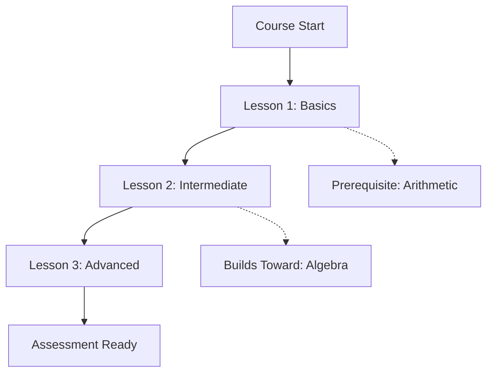
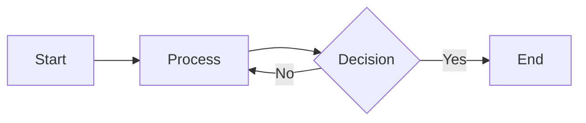
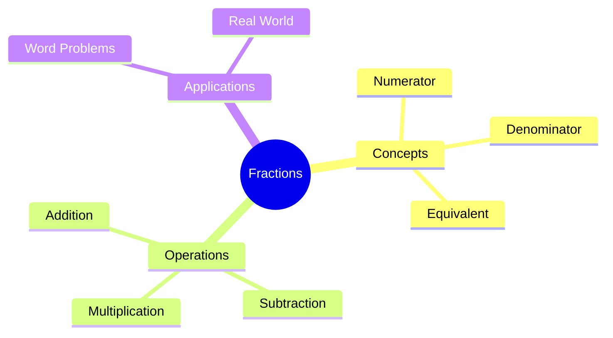

# Revision Notes Output Schema

**Purpose**: Define expected markdown structure for course cheat sheets and per-lesson notes.

---

## Output File 1: Course Cheat Sheet

**Filename**: `course_cheat_sheet.md`

**Word Count Target**: 1500-2500 words (150-250 words per lesson)

**Purpose**: Quick reference guide consolidating all lessons for exam preparation.

### Template Structure

```markdown
# [Course Title] - Quick Revision Guide

## Course Overview

- **Subject**: [e.g., Mathematics]
- **Level**: [e.g., National 5]
- **Total Lessons**: [e.g., 12]
- **Key Assessment Standards**: [List main SQA codes from course_outcomes.json]

---

## Learning Outcomes Summary

1. **[Outcome Code]**: [Brief description] → Covered in Lessons [X, Y, Z]
2. **[Outcome Code]**: [Brief description] → Covered in Lessons [A, B]
...

---

## Lessons at a Glance

### Lesson 1: [Title from SOW entry]

**Key Concepts**:
- [Concept 1 from key_concepts field]
- [Concept 2]
- [Concept 3]

**Must Remember**:
[Critical formula, rule, or method - extracted from worked_examples or key_concepts]

**Common Mistake**:
❌ **What students think**: [From misconceptions field if available]
✓ **Actual truth**: [Correct understanding]

**Quick Check**:
[1 practice question from practice_problems or worked_examples]

---

### Lesson 2: [Title]
[Same structure repeated]

---

## Quick Reference

### Formulas Sheet

| Topic | Formula | Example |
|-------|---------|---------|
| [Lesson 1 topic] | `$...$` | `$\\frac{2}{5} \\times 20 = 8$` |
| [Lesson 2 topic] | `$...$` | ... |

### Misconceptions to Avoid

1. ❌ **[Common error from Lesson X]** → ✓ [Correct approach]
2. ❌ **[Common error from Lesson Y]** → ✓ [Correct approach]
...

### Assessment Standard Checklist

- [ ] **[Outcome Code]** - Practice with Lesson [X] questions
- [ ] **[Outcome Code]** - Practice with Lesson [Y] questions
...

---

## Concept Map



---

## Exam Preparation Tips

1. **First Review (Day 2)**: Read through key concepts - 15 minutes
2. **Second Review (Day 5)**: Practice quick check questions - 20 minutes
3. **Third Review (Week 2)**: Attempt past paper questions - 30 minutes
4. **Final Review (Month 1)**: Full topic revision - 1 hour

---

**Remember**: This is a quick reference guide. For detailed explanations, see per-lesson notes.
```

---

## Output File 2: Per-Lesson Notes (TEACH Lessons)

**Filename Pattern**: `lesson_notes_01.md`, `lesson_notes_02.md`, etc.

**Word Count Target**: 200-350 words per TEACH lesson (50-100 words for revision/assessment)

**Purpose**: Fast, concept-focused revision for quick retention.

**Key Principle**: Focus on **concepts**, not cards. Merge related cards into unified concept sections for faster revision and better retention.

### Template Structure (TEACH Lessons)

```markdown
# Lesson [N]: [Title from lesson template]

**Duration**: [estMinutes from template] minutes | **Type**: teach | **Outcomes**: [O1, AS1.1]

---

## 📚 Concept Notes

### [Concept 1 Name - extracted from card titles]

- **Key Point**: [One-sentence summary of the concept]
- **Formula**: $formula$ (if applicable, e.g., $\frac{numerator}{denominator} \times amount = result$)
- ⚠️ **Watch out**: [Inline misconception - what students often get wrong]

📊 **Visual** (if diagram exists for this concept):


### [Concept 2 Name]

- **Key Point**: [One-sentence summary]
- **Example**: [Brief worked example if critical, e.g., "Find 2/5 of 20 → (2÷5)×20 = 8"]
- ⚠️ **Watch out**: [Inline misconception]

### [Concept 3 Name]

- **Key Point**: [One-sentence summary]
- **Formula**: $formula$ (if applicable)

---

## 📝 Cornell Notes

| Cues (Questions) | Notes (Key Points) |
|------------------|-------------------|
| What is [concept]? | [Brief answer - 1-2 sentences max] |
| How do you calculate [X]? | [Formula + method] |
| What's the common mistake with [Y]? | [Misconception + fix] |

**Summary** (2-3 sentences):
[Synthesize the lesson's core takeaway - students should write this in their own words]

---

## ✅ Quick Self-Test

1. **Q**: [CFU question from cards]
   <details><summary>Answer</summary>[Answer with brief working if needed]</details>

2. **Q**: [CFU question from cards]
   <details><summary>Answer</summary>[Answer]</details>

---

## 🔗 Navigation

**Prerequisites**: [→ See: Lesson M] | **Next**: [→ See: Lesson P]

---

**Word Count**: ~[actual] words
```

### Key Differences from Card-by-Card Approach

| Aspect | Old Approach | New Concept-Based Approach |
|--------|--------------|---------------------------|
| Structure | Card 1, Card 2, Card 3... | Concept A, Concept B, Concept C... |
| Misconceptions | Separate section at end | ⚠️ Inline with each concept |
| Formulas | Separate "Formulas Sheet" | Inline with relevant concept |
| Diagrams | "Visual References" section | Inline under relevant concept |
| Word Count | 300-600 words | 200-350 words |
| Focus | Comprehensive breakdown | Fast recap, retention |

### Diagram Embedding (Inline with Concepts)

**For Lessons WITH Diagrams** - embed directly under the relevant concept:
```markdown
### Perimeter Calculation

- **Key Point**: Perimeter is the total distance around a shape
- **Formula**: $P = 2(l + w)$ for rectangles
- ⚠️ **Watch out**: Don't include sides that don't need fencing (e.g., walls)

📊 **Visual**:

```

**For Lessons WITHOUT Diagrams**:
```markdown
📊 *No visual diagrams available - create your own sketch to aid memory.*
```

### Implementation Notes
- Use `diagram_description` field as both alt text AND image title
- The `image_url` field contains the full Appwrite Storage URL (pre-constructed)
- Match diagrams to concepts by `lessonTemplateId` and `cardId` fields
- **Always inline diagrams** - no separate "Visual References" section

---

## Formatting Guidelines

### Markdown Syntax

✅ **Use**:
- `#` for main title, `##` for sections, `###` for subsections
- `**bold**` for emphasis
- `- ` for bullet lists
- `` `code` `` for inline code or math variables
- ` ```mermaid ... ``` ` for diagrams
- `| Table | Headers |` for tables

❌ **Avoid**:
- HTML tags (use pure markdown)
- Inconsistent heading levels (don't skip from # to ###)
- Unescaped special characters in LaTeX

### LaTeX Math Notation

✅ **Inline math**: `$\frac{2}{5}$` renders as $\frac{2}{5}$
✅ **Display math**: `$$\frac{2}{5} \times 20 = 8$$` renders as:

$$\frac{2}{5} \times 20 = 8$$

✅ **Common LaTeX**:
- Fractions: `\frac{numerator}{denominator}`
- Multiplication: `\times`
- Division: `\div`
- Equals: `=`
- Superscript: `x^{2}`
- Subscript: `x_{1}`

### Mermaid Diagrams

✅ **Flowchart** (concept relationships):


✅ **Mind Map** (topic breakdown):


### Cross-References

✅ **Internal links**: `[→ See: Lesson 5]` (no actual hyperlink, just reference)
✅ **External references**: `[SQA Assessment Standard MTH_3_07a]`

---

## Example: Completed Cheat Sheet Excerpt

```markdown
### Lesson 3: Fractions of Amounts

**Key Concepts**:
- Multiplying fractions by whole numbers
- Converting fractions to decimals for calculation
- Word problem interpretation ("of" means multiply)

**Must Remember**:
Formula: $\frac{numerator}{denominator} \times amount = result$

**Common Mistake**:
❌ **What students think**: "2/5 of 20" means divide 20 by 2 and then by 5
✓ **Actual truth**: Multiply the fraction by the amount → $(2 \div 5) \times 20 = 0.4 \times 20 = 8$

**Quick Check**:
Find 3/4 of 16
<details>
<summary>Show Answer</summary>
$(3 \div 4) \times 16 = 0.75 \times 16 = 12$
</details>
```

---

## Example: Completed TEACH Lesson Note (Concept-Based)

```markdown
# Lesson 3: Fractions of Amounts

**Duration**: 50 minutes | **Type**: teach | **Outcomes**: O1, AS1.2

---

## 📚 Concept Notes

### Fraction to Decimal Conversion

- **Key Point**: Divide numerator by denominator to convert any fraction to decimal
- **Formula**: $\frac{a}{b} = a \div b$
- ⚠️ **Watch out**: Don't divide denominator by numerator (8÷3 is wrong for 3/8)

### Finding a Fraction of an Amount

- **Key Point**: "Of" means multiply - convert fraction to decimal, then multiply
- **Example**: Find 2/5 of 20 → (2÷5)×20 = 0.4×20 = 8
- ⚠️ **Watch out**: Don't divide the amount by both numbers separately

---

## 📝 Cornell Notes

| Cues (Questions) | Notes (Key Points) |
|------------------|-------------------|
| How to convert fraction to decimal? | Divide numerator by denominator: $\frac{3}{8} = 3÷8 = 0.375$ |
| What does "of" mean in fractions? | Multiply: $\frac{2}{5}$ of 20 = $\frac{2}{5} × 20 = 8$ |
| Common mistake with division order? | Always top ÷ bottom, never bottom ÷ top |

**Summary**: Fractions represent division. Convert to decimals by dividing, then multiply to find amounts.

---

## ✅ Quick Self-Test

1. **Q**: Convert 3/4 to a decimal
   <details><summary>Answer</summary>3 ÷ 4 = 0.75</details>

2. **Q**: Find 3/5 of 25
   <details><summary>Answer</summary>(3÷5)×25 = 0.6×25 = 15</details>

---

## 🔗 Navigation

**Prerequisites**: [→ See: Lesson 2] | **Next**: [→ See: Lesson 4]

---

**Word Count**: ~210 words
```

---

## Validation Checklist

Before finalizing output files, verify:

**Cheat Sheet**:
- [ ] Course title and metadata present
- [ ] All lessons from SOW included
- [ ] Learning outcomes mapped to lessons
- [ ] Formulas sheet consolidated
- [ ] Misconceptions section complete
- [ ] Mermaid concept map included
- [ ] Word count: 1500-2500 words

**Per-Lesson Notes (TEACH)**:
- [ ] One file per lesson (matching SOW order)
- [ ] **Concept-based structure** (NOT card-by-card)
- [ ] ⚠️ Misconceptions inline with concepts
- [ ] Formulas inline with concepts
- [ ] Diagrams inline with concepts (if available)
- [ ] Cornell Notes table with Cues/Notes + Summary
- [ ] Quick Self-Test with CFU questions
- [ ] Navigation section with prerequisites/next
- [ ] Word count: **200-350 words** per TEACH lesson

**Per-Lesson Notes (Revision/Assessment)**:
- [ ] Brief reference format (50-100 words)
- [ ] Clear reference to prerequisite teach lessons
- [ ] No card-by-card breakdown

**Formatting**:
- [ ] Valid markdown syntax (no broken headers/lists)
- [ ] LaTeX math notation preserved and escaped
- [ ] Mermaid diagrams use correct syntax
- [ ] Tables formatted properly
- [ ] Cross-references use consistent format

---

**This schema ensures consistency and completeness across all generated revision notes.**
