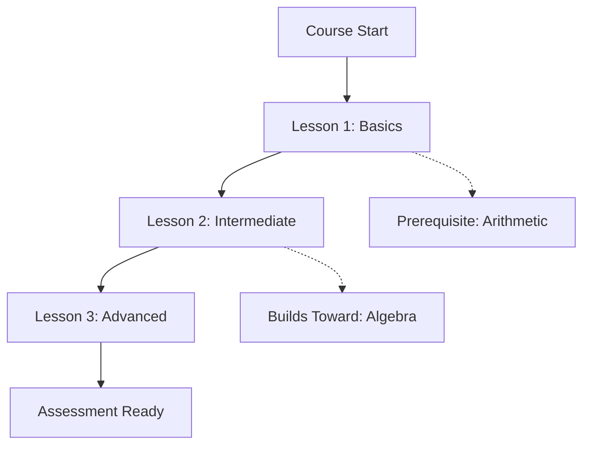
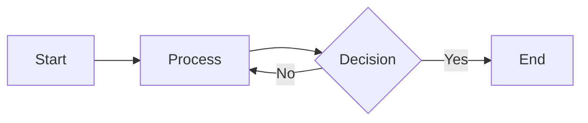
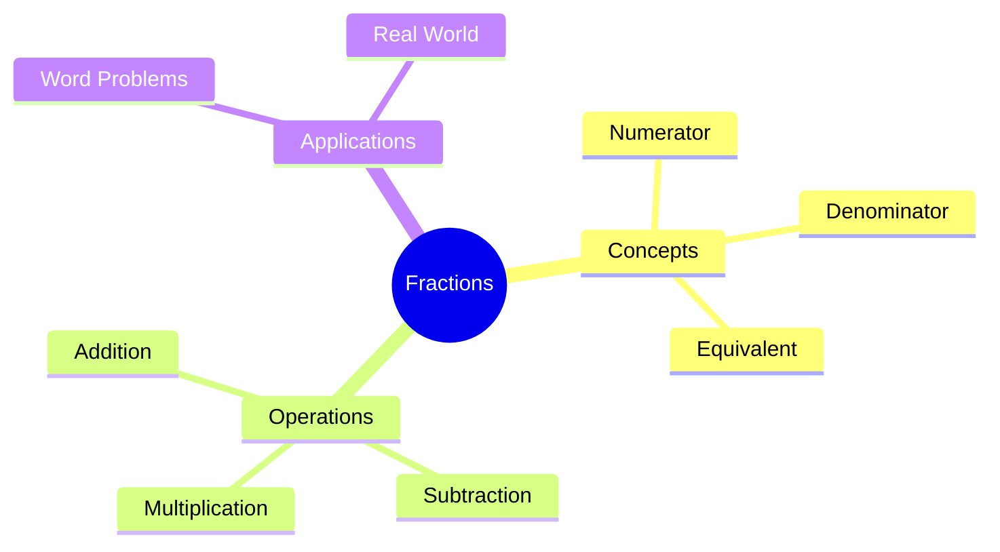

# Revision Notes Output Schema

**Purpose**: Define expected markdown structure for course cheat sheets and per-lesson notes.

---

## Output File 1: Course Cheat Sheet

**Filename**: `course_cheat_sheet.md`

**Word Count Target**: 1500-2500 words (150-250 words per lesson)

**Purpose**: Quick reference guide consolidating all lessons for exam preparation.

### Template Structure

```markdown
# [Course Title] - Quick Revision Guide

## Course Overview

- **Subject**: [e.g., Mathematics]
- **Level**: [e.g., National 5]
- **Total Lessons**: [e.g., 12]
- **Key Assessment Standards**: [List main SQA codes from course_outcomes.json]

---

## Learning Outcomes Summary

1. **[Outcome Code]**: [Brief description] → Covered in Lessons [X, Y, Z]
2. **[Outcome Code]**: [Brief description] → Covered in Lessons [A, B]
...

---

## Lessons at a Glance

### Lesson 1: [Title from SOW entry]

**Key Concepts**:
- [Concept 1 from key_concepts field]
- [Concept 2]
- [Concept 3]

**Must Remember**:
[Critical formula, rule, or method - extracted from worked_examples or key_concepts]

**Common Mistake**:
❌ **What students think**: [From misconceptions field if available]
✓ **Actual truth**: [Correct understanding]

**Quick Check**:
[1 practice question from practice_problems or worked_examples]

---

### Lesson 2: [Title]
[Same structure repeated]

---

## Quick Reference

### Formulas Sheet

| Topic | Formula | Example |
|-------|---------|---------|
| [Lesson 1 topic] | `$...$` | `$\\frac{2}{5} \\times 20 = 8$` |
| [Lesson 2 topic] | `$...$` | ... |

### Misconceptions to Avoid

1. ❌ **[Common error from Lesson X]** → ✓ [Correct approach]
2. ❌ **[Common error from Lesson Y]** → ✓ [Correct approach]
...

### Assessment Standard Checklist

- [ ] **[Outcome Code]** - Practice with Lesson [X] questions
- [ ] **[Outcome Code]** - Practice with Lesson [Y] questions
...

---

## Concept Map



---

## Exam Preparation Tips

1. **First Review (Day 2)**: Read through key concepts - 15 minutes
2. **Second Review (Day 5)**: Practice quick check questions - 20 minutes
3. **Third Review (Week 2)**: Attempt past paper questions - 30 minutes
4. **Final Review (Month 1)**: Full topic revision - 1 hour

---

**Remember**: This is a quick reference guide. For detailed explanations, see per-lesson notes.
```

---

## Output File 2: Per-Lesson Notes

**Filename Pattern**: `lesson_notes_01.md`, `lesson_notes_02.md`, etc.

**Word Count Target**: 300-600 words per lesson

**Purpose**: Detailed breakdown of lesson content for deep understanding.

### Template Structure

```markdown
# Lesson [N]: [Title from lesson template]

**Duration**: [estMinutes from template] minutes | **Type**: [lesson_type - teach/practice/assess]

---

## Lesson Summary

**Prerequisites**:
- [→ See: Lesson M] [Topic name]
- [→ See: Lesson K] [Topic name]

**Builds Toward**:
- [→ See: Lesson P] [Future topic]
- [→ See: Lesson Q] [Future topic]

**Learning Outcomes**:
- [Outcome Code from SOW entry's outcomes array]: [Description from course_outcomes.json]

---

## Card-by-Card Breakdown

### Card 1: [card.type] - [Extract topic from card.explainer first line]

**Key Learning**:
- [Main point 1 extracted from explainer content]
- [Main point 2]

**Worked Example** (if present):
[From card.explainer - extract step-by-step solution]

Example:
```
Problem: Find 2/5 of 20
Step 1: Convert fraction to division → 2 ÷ 5 = 0.4
Step 2: Multiply by amount → 0.4 × 20 = 8
Answer: 8
```

**Common Pitfall** (if card.misconceptions exists):
❌ **Mistake**: [Reference misconception from card.misconceptions array]
✓ **Correct**: [How to avoid this error]

---

### Card 2: [type] - [Topic]
[Same structure repeated for each card in lesson template]

---

## Common Misconceptions

### Misconception 1: [From any card's misconceptions field]
- **What it is**: [Brief explanation of the error]
- **Why it's wrong**: [Conceptual explanation]
- **How to fix**: [Correct approach with example]

[Repeat for each misconception found in lesson cards]

---

## Checkpoint Questions

Test your understanding with these questions from the lesson:

1. [CFU question from card with type="cfu"]
   <details>
   <summary>Show Answer</summary>
   [Answer extracted from CFU card content]
   </details>

2. [Another CFU question]
   <details>
   <summary>Show Answer</summary>
   [Answer]
   </details>

---

## Visual References

**Format**: Embed diagrams inline using markdown image syntax with pre-constructed Appwrite Storage URLs.

### For Lessons WITH Diagrams:

**Preferred Approach** (Inline with Cards):
```markdown
### Card 3: Garden Fencing Problem

**Key Learning**: Calculate perimeter when one side is not counted

📊 **Visual Diagram**:


*This diagram shows the problem setup with labeled dimensions for calculating perimeter and area.*

**Worked Example**: ...
```

**Alternative Approach** (Consolidated Section):
```markdown
## Visual References

### Card 1: [Card Title]

📊 **Diagram**:


**Context**: {diagram_context} - Explains the problem setup visually
**Purpose**: Helps visualize the relationship between dimensions and calculation method

### Card 3: [Card Title]

📊 **Diagram**:


**Context**: {diagram_context} - Shows worked solution steps
**Purpose**: Reinforces correct calculation procedure with visual feedback
```

### For Lessons WITHOUT Diagrams:

```markdown
📊 **No visual diagrams available for this lesson.**
**Alternative**: Create your own sketch of [key concept] to aid memory.
```

**Implementation Notes**:
- Use `diagram_description` field as both alt text AND image title
- The `image_url` field contains the full Appwrite Storage URL (pre-constructed in pre-processing)
- Match diagrams to cards using `lessonTemplateId` and `cardId` fields
- Inline placement (Option 1) is preferred for better learning context

---

## Cornell Method Notes Template

Use this structure for your own notes while studying:

| Cues/Questions | Notes | Examples |
|----------------|-------|----------|
| [What is the key formula?] | [Main concept from Card 1] | [Worked example from Card 1] |
| [When to use this method?] | [Application context from Card 2] | [Real-world scenario] |
| [Common mistake to avoid?] | [Misconception from above] | [Counter-example showing correct way] |

---

## Review Schedule

📅 **Spaced Repetition Plan**:
- **Day 2**: Review key concepts section (5 min)
- **Day 5**: Attempt checkpoint questions without notes (10 min)
- **Week 2**: Practice similar problems from past papers (15 min)
- **Month 1**: Full lesson review before assessment (20 min)

---

## Notes Coverage

✅ **Covered in this lesson**:
- [Key Concept 1 from cards]
- [Key Concept 2 from cards]

⚠️ **Not covered / missing data**:
- [Any gaps identified, e.g., "No worked examples for subtopic X"]
- [Any missing diagrams or resources]

**Suggestion**: Consult teacher or textbook for additional examples if needed.

---

**Next Lesson**: [→ See: Lesson [N+1]] [Title of next lesson]
```

---

## Formatting Guidelines

### Markdown Syntax

✅ **Use**:
- `#` for main title, `##` for sections, `###` for subsections
- `**bold**` for emphasis
- `- ` for bullet lists
- `` `code` `` for inline code or math variables
- ` ```mermaid ... ``` ` for diagrams
- `| Table | Headers |` for tables

❌ **Avoid**:
- HTML tags (use pure markdown)
- Inconsistent heading levels (don't skip from # to ###)
- Unescaped special characters in LaTeX

### LaTeX Math Notation

✅ **Inline math**: `$\frac{2}{5}$` renders as $\frac{2}{5}$
✅ **Display math**: `$$\frac{2}{5} \times 20 = 8$$` renders as:

$$\frac{2}{5} \times 20 = 8$$

✅ **Common LaTeX**:
- Fractions: `\frac{numerator}{denominator}`
- Multiplication: `\times`
- Division: `\div`
- Equals: `=`
- Superscript: `x^{2}`
- Subscript: `x_{1}`

### Mermaid Diagrams

✅ **Flowchart** (concept relationships):


✅ **Mind Map** (topic breakdown):


### Cross-References

✅ **Internal links**: `[→ See: Lesson 5]` (no actual hyperlink, just reference)
✅ **External references**: `[SQA Assessment Standard MTH_3_07a]`

---

## Example: Completed Cheat Sheet Excerpt

```markdown
### Lesson 3: Fractions of Amounts

**Key Concepts**:
- Multiplying fractions by whole numbers
- Converting fractions to decimals for calculation
- Word problem interpretation ("of" means multiply)

**Must Remember**:
Formula: $\frac{numerator}{denominator} \times amount = result$

**Common Mistake**:
❌ **What students think**: "2/5 of 20" means divide 20 by 2 and then by 5
✓ **Actual truth**: Multiply the fraction by the amount → $(2 \div 5) \times 20 = 0.4 \times 20 = 8$

**Quick Check**:
Find 3/4 of 16
<details>
<summary>Show Answer</summary>
$(3 \div 4) \times 16 = 0.75 \times 16 = 12$
</details>
```

---

## Example: Completed Lesson Note Excerpt

```markdown
### Card 2: explainer - Converting Fractions to Decimals

**Key Learning**:
- Divide numerator by denominator to get decimal equivalent
- Use long division if calculator not available
- Round to appropriate decimal places (usually 2-3 for practical problems)

**Worked Example**:
```
Problem: Convert 3/8 to decimal
Step 1: Set up division → 3 ÷ 8
Step 2: Perform calculation → 0.375
Answer: 0.375 (exact) or 0.38 (rounded to 2 d.p.)
```

**Common Pitfall**:
❌ **Mistake**: Dividing denominator by numerator (8 ÷ 3)
✓ **Correct**: Always numerator ÷ denominator (3 ÷ 8)
**Why**: The fraction bar means "divided by" - top number divided by bottom number
```

---

## Validation Checklist

Before finalizing output files, verify:

**Cheat Sheet**:
- [ ] Course title and metadata present
- [ ] All lessons from SOW included
- [ ] Learning outcomes mapped to lessons
- [ ] Formulas sheet consolidated
- [ ] Misconceptions section complete
- [ ] Mermaid concept map included
- [ ] Word count: 1500-2500 words

**Per-Lesson Notes**:
- [ ] One file per lesson (matching SOW order)
- [ ] All cards from lesson template covered
- [ ] Worked examples extracted
- [ ] Misconceptions documented
- [ ] CFU questions included as checkpoints
- [ ] Lesson diagrams referenced (or noted as missing)
- [ ] Review schedule included
- [ ] Word count: 300-600 words per file

**Formatting**:
- [ ] Valid markdown syntax (no broken headers/lists)
- [ ] LaTeX math notation preserved and escaped
- [ ] Mermaid diagrams use correct syntax
- [ ] Tables formatted properly
- [ ] Cross-references use consistent format

---

**This schema ensures consistency and completeness across all generated revision notes.**
