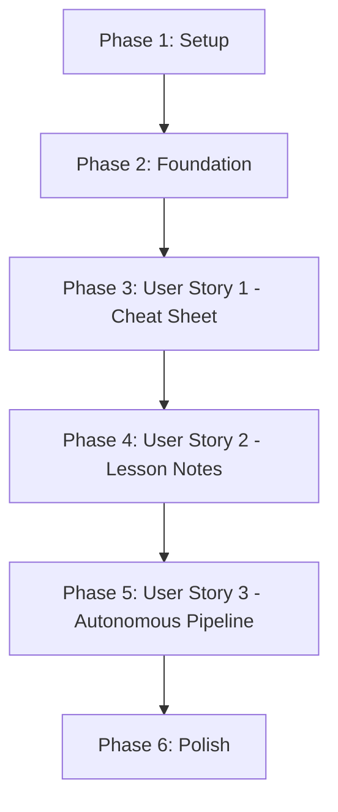

# Tasks: Course Revision Notes Author Agent

**Input**: Design documents from `/specs/002-revision-notes-author/`
**Prerequisites**: plan.md, spec.md, research.md, data-model.md, contracts/

**Tests**: Tests are NOT explicitly requested in this specification - focusing on implementation tasks only

**Organization**: Tasks are grouped by user story to enable independent implementation and testing of each story.

## Format: `[ID] [P?] [Story] Description`
- **[P]**: Can run in parallel (different files, no dependencies)
- **[Story]**: Which user story this task belongs to (e.g., US1, US2, US3)
- Include exact file paths in descriptions

**Constitution Compliance**: All tasks must respect `.specify/memory/constitution.md`:
- Fast-fail: No fallback patterns - exceptions with detailed logging
- Code quality: Files <500 lines, functions <50 lines (refactor if needed)
- Documentation: Update PRD/brief/task files as part of "done"
- Testing: Include Playwright manual test validation tasks

## Path Conventions

```
claud_author_agent/
├── src/
│   ├── notes_author_claude_client.py  # Main orchestrator
│   ├── prompts/
│   │   ├── notes_author_prompt.md     # Subagent prompt
│   │   └── schemas/
│   │       └── revision_notes_output.md
│   └── utils/
│       ├── notes_data_extractor.py    # Extract from Appwrite
│       └── notes_storage_upserter.py  # Upload to Storage + DB
├── scripts/
│   ├── notes_author_cli.py            # CLI interface
│   └── setup_revision_notes_infrastructure.py
└── docs/guides/
    └── notes-author-guide.md
```

---

## Phase 1: Setup (Shared Infrastructure)

**Purpose**: One-time Appwrite infrastructure setup and project structure

**MCP Pattern**: Setup script uses appwrite_mcp.py utilities with mcp_config_path parameter

- [X] T001 Create Appwrite infrastructure setup script at claud_author_agent/scripts/setup_revision_notes_infrastructure.py using appwrite_mcp.py utilities
- [X] T002 [P] Implement `create_revision_notes_collection(mcp_config_path)` in setup script using create_appwrite_collection and create_appwrite_attribute to create collection with all attributes per data-model.md
- [X] T003 [P] Implement `create_documents_storage_bucket(mcp_config_path)` in setup script using create_appwrite_bucket to create Storage bucket with permissions/config per spec.md
- [ ] T004 Run infrastructure setup script to create revision_notes collection and documents bucket in Appwrite
- [X] T005 [P] Create prompts directory structure: claud_author_agent/src/prompts/notes_author_prompt.md and schemas/revision_notes_output.md
- [X] T006 [P] Create docs/guides directory for notes-author-guide.md

**Checkpoint**: Infrastructure ready - development can begin

---

## Phase 2: Foundational (Blocking Prerequisites)

**Purpose**: Core utilities and extraction logic that ALL user stories depend on

**⚠️ CRITICAL**: No user story work can begin until this phase is complete

**MCP Pattern**: All utilities use existing `appwrite_mcp.py` wrapper functions with `mcp_config_path` parameter

- [X] T007 Create notes_data_extractor.py wrapping appwrite_mcp.py utilities (list_appwrite_documents, get_appwrite_document) with mcp_config_path parameter
- [X] T008 [P] Implement `extract_course_metadata(courseId, mcp_config_path)` in notes_data_extractor.py to fetch from default.courses using list_appwrite_documents
- [X] T009 [P] Implement `extract_authored_sow(courseId, mcp_config_path)` in notes_data_extractor.py with decompression and validation (status=published) using get_appwrite_document
- [X] T010 [P] Implement `extract_lesson_templates(courseId, mcp_config_path)` in notes_data_extractor.py with card decompression using list_appwrite_documents
- [X] T011 [P] Implement `extract_course_data(subject, level, mcp_config_path)` in notes_data_extractor.py to generate Course_data.txt from sqa_education.sqa_current using list_appwrite_documents
- [X] T012 [P] Implement `extract_course_outcomes(subject, level, mcp_config_path)` in notes_data_extractor.py from sqa_education.course_outcomes using list_appwrite_documents
- [X] T013 [P] Implement `extract_lesson_diagrams(courseId, lesson_template_ids, mcp_config_path)` in notes_data_extractor.py using list_appwrite_documents (optional - throw exception if NONE exist per edge case spec)
- [X] T014 Create notes_storage_upserter.py wrapping appwrite_mcp.py Storage and DB utilities with mcp_config_path parameter
- [X] T015 [P] Implement `upload_markdown_to_storage(bucket_id, file_path, file_id, mcp_config_path)` in notes_storage_upserter.py using upload_to_appwrite_storage from appwrite_mcp.py
- [X] T016 [P] Implement `create_revision_note_document(database_id, collection_id, document_id, data, mcp_config_path)` in notes_storage_upserter.py using create_appwrite_document with atomic upsert logic
- [X] T017 [P] Implement `upsert_revision_note(note_path, courseId, noteType, lessonOrder, version, execution_id, mcp_config_path)` in notes_storage_upserter.py integrating upload + DB operations

**Checkpoint**: Foundation ready - user story implementation can now begin in parallel

---

## Phase 3: User Story 1 - Generate Course-Level Cheat Sheet (Priority: P1) 🎯 MVP

**Goal**: Generate a comprehensive course-level cheat sheet markdown file summarizing all lessons and learning outcomes

**Independent Test**: Execute agent with valid courseId, verify course_cheat_sheet.md generated with sections for all lessons

### Implementation for User Story 1

- [x] T018 [P] [US1] Write notes_author_prompt.md with instructions for course cheat sheet generation using Cornell Method, Mermaid diagrams, and pedagogical techniques from research.md
- [x] T019 [P] [US1] Write schemas/revision_notes_output.md documenting expected markdown structure for course cheat sheet per research.md
- [x] T020 [US1] Create notes_author_claude_client.py with NotesAuthorClaudeClient class skeleton (IsolatedFilesystem, CostTracker, logging setup)
- [x] T021 [US1] Implement `_validate_course_exists(courseId)` in notes_author_claude_client.py with fail-fast validation
- [x] T022 [US1] Implement `_validate_published_sow_exists(courseId)` in notes_author_claude_client.py with fail-fast validation
- [x] T023 [US1] Implement pre-processing method `_extract_data_to_workspace(courseId, workspace_path)` in notes_author_claude_client.py calling all extractor functions from T007-T013
- [x] T024 [US1] Implement `_build_initial_prompt(courseId, workspace_path)` in notes_author_claude_client.py to construct agent prompt with file paths and requirements
- [x] T025 [US1] Implement agent execution logic in notes_author_claude_client.py using Claude Agent SDK with notes_author subagent, bypassPermissions mode, allowed_tools from spec.md FR-011 - IMPORTANT: Subagent gets NO Appwrite MCP access (only validator MCP for schema validation, saves 5-10K tokens per execution)
- [x] T026 [US1] Implement post-processing method `_upload_cheat_sheet_to_storage(workspace_path, courseId, version, execution_id)` in notes_author_claude_client.py for course_cheat_sheet.md only
- [x] T027 [US1] Implement main `execute(courseId, version, force)` method in notes_author_claude_client.py orchestrating validation → pre-processing → agent → post-processing
- [x] T028 [US1] Add cost tracking and logging to execute() method capturing token usage per subagent and total cost
- [x] T029 [US1] Create notes_author_cli.py with argparse for --courseId, --version, --force, --mcp-config, --persist-workspace, --log-level flags per spec.md FR-025
- [x] T030 [US1] Implement CLI main() function in notes_author_cli.py invoking NotesAuthorClaudeClient.execute() and displaying results

**Manual Validation for User Story 1**:
- [ ] T031 [US1] Test with Playwright: Execute notes_author_cli.py --courseId course_c84874 and verify course_cheat_sheet.md created in workspace
- [ ] T032 [US1] Test with Playwright: Query revision_notes collection and verify cheat_sheet document with markdown_file_id exists
- [ ] T033 [US1] Test with Playwright: Download markdown from Storage bucket using markdown_file_id and verify content includes Course Overview, Learning Outcomes, Lessons at a Glance sections per research.md
- [ ] T034 [US1] Test edge case with Playwright: Execute with draft SOW (status="draft") and verify detailed exception thrown per spec.md edge cases

---

## Phase 4: User Story 2 - Generate Per-Lesson Quick Notes (Priority: P2)

**Goal**: Generate focused, lesson-specific revision notes breaking down lesson content into digestible summaries

**Independent Test**: Execute agent for course with 10 lessons, verify 10 lesson_notes_NN.md files generated with card-by-card breakdowns

### Implementation for User Story 2

- [x] T035 [P] [US2] Update notes_author_prompt.md to include per-lesson notes generation instructions with Card-by-Card Breakdown, Worked Examples, Common Misconceptions sections per research.md
- [x] T036 [P] [US2] Update schemas/revision_notes_output.md to document expected markdown structure for per-lesson notes including Cornell tables, checkpoint questions, review schedule
- [x] T037 [US2] Implement `_upload_lesson_notes_to_storage(workspace_path, courseId, lesson_templates, version, execution_id)` in notes_author_claude_client.py for all lesson_notes_NN.md files
- [x] T038 [US2] Update execute() method in notes_author_claude_client.py to call _upload_lesson_notes_to_storage() after cheat sheet upload
- [x] T039 [US2] Add validation in execute() method to verify all expected lesson_notes_NN.md files exist before post-processing per spec.md FR-014

**Manual Validation for User Story 2**:
- [ ] T040 [US2] Test with Playwright: Execute notes_author_cli.py --courseId course_c84874 and verify N lesson_notes_NN.md files created (where N = number of lessons)
- [ ] T041 [US2] Test with Playwright: Query revision_notes collection and verify N lesson_note documents with correct lessonOrder values exist
- [ ] T042 [US2] Test with Playwright: Download lesson note markdown from Storage and verify sections include Lesson Summary, Card-by-Card Breakdown, Common Misconceptions, Checkpoint Questions, Review Schedule per research.md
- [ ] T043 [US2] Test edge case with Playwright: Execute for lesson missing worked examples and verify "Notes Coverage" section documents the gap per spec.md edge cases

---

## Phase 5: User Story 3 - Autonomous Pipeline with Pre/Post Processing (Priority: P3)

**Goal**: End-to-end autonomous pipeline executing without manual intervention

**Independent Test**: Execute agent with only courseId as input, verify all phases complete successfully without errors

### Implementation for User Story 3

- [x] T044 [US3] Implement workspace cleanup logic in notes_author_claude_client.py respecting persist_workspace flag per spec.md FR-026
- [x] T045 [US3] Add execution metrics logging in execute() method: pre-processing time, agent execution time, post-processing time, workspace cleanup time per spec.md FR-024
- [x] T046 [US3] Implement duplicate note prevention check in execute() method querying existing revision_notes before execution (force flag override) per spec.md edge cases
- [x] T047 [US3] Add concurrent execution safety with execution_id tracking in post-processing per spec.md edge cases (atomic replacement, last write wins)
- [x] T048 [US3] Implement versioning support in execute() method linking revision notes to SOW version per spec.md FR-023

**Manual Validation for User Story 3**:
- [ ] T049 [US3] Test with Playwright: Execute notes_author_cli.py --courseId course_c84874 without --persist-workspace and verify workspace auto-deleted after completion
- [ ] T050 [US3] Test with Playwright: Execute notes_author_cli.py --courseId course_c84874 --persist-workspace and verify workspace preserved at logged path
- [ ] T051 [US3] Test with Playwright: Execute agent twice for same course and verify exception thrown on second run (duplicate prevention)
- [ ] T052 [US3] Test with Playwright: Execute agent with --force flag and verify existing notes overwritten with new execution_id
- [ ] T053 [US3] Test edge case with Playwright: Execute for course with 25+ lessons and verify hierarchical structuring used in cheat sheet per spec.md edge cases
- [ ] T054 [US3] Test edge case with Playwright: Execute for course with NO lesson diagrams and verify Mermaid diagrams generated as fallback per spec.md edge cases and research.md decision

---

## Phase 6: Polish & Cross-Cutting Concerns

**Purpose**: Documentation, final validations, and production readiness

- [ ] T055 [P] Write docs/guides/notes-author-guide.md with usage examples, troubleshooting, cost estimation per quickstart.md
- [ ] T056 [P] Update claud_author_agent/README.md to add Revision Notes Author to agent list and typical workflow section
- [ ] T057 [P] Add cost estimation utility function to notes_author_claude_client.py calculating estimated cost based on token usage
- [ ] T058 [P] Implement detailed exception messages for all validation failures with context (courseId, SOW status, missing data) per constitution fast-fail principle
- [ ] T059 [P] Add comprehensive logging throughout pipeline (DEBUG level for workspace operations, INFO for major phases, ERROR for failures) per constitution documentation principle
- [ ] T060 Refactor notes_author_claude_client.py if exceeding 450 lines by extracting validation logic to notes_validator.py utility per constitution code quality principle
- [ ] T061 Refactor notes_author_prompt.md if exceeding 500 lines by splitting into cheat_sheet_prompt.md and lesson_notes_prompt.md per constitution code quality principle
- [ ] T062 Update plan.md status sections marking all phases complete and documenting any implementation deviations from original plan
- [ ] T063 Update spec.md if any assumptions changed during implementation (document actual markdown word counts, token usage observed) per constitution documentation principle
- [ ] T064 [P] Add example outputs to docs/guides/notes-author-guide.md showing sample cheat sheet and lesson note structure

**Final Manual Validation**:
- [ ] T065 Test complete workflow with Playwright: Fresh Appwrite instance → infrastructure setup → agent execution → markdown retrieval → verify all success criteria from spec.md SC-001 through SC-010
- [ ] T066 Measure and document actual performance metrics: execution time for 10-lesson course, token usage, cost per execution - compare against spec.md success criteria SC-001, SC-009
- [ ] T067 Verify markdown linting: Run markdown linter on generated cheat sheet and lesson notes to confirm 95% pass rate per spec.md SC-007

---

## Dependencies & Execution Order

### Story Completion Order



### Parallel Execution Opportunities

**Phase 1 (Setup)**: Tasks T002-T003, T005-T006 can run in parallel (different files)

**Phase 2 (Foundation)**: Tasks T008-T013, T015-T017 can run in parallel (different functions)

**Phase 3 (US1)**: Tasks T018-T019 can run in parallel (documentation), but T020-T030 are sequential due to dependencies

**Phase 4 (US2)**: Tasks T035-T036 can run in parallel with documentation updates

**Phase 6 (Polish)**: Tasks T055-T059, T064 can run in parallel (different files)

### MVP Scope (Recommended First Delivery)

**Phase 1 + Phase 2 + Phase 3** = Minimum Viable Product
- Infrastructure setup (T001-T006)
- Core extraction/upload utilities (T007-T017)
- Course cheat sheet generation only (T018-T034)

Delivers: Teachers/students can generate course-level cheat sheets for exam preparation (User Story 1 = P1 priority)

**Incremental Delivery**:
1. MVP: Cheat sheet generation (Phase 1-3)
2. Phase 4: Add per-lesson notes
3. Phase 5: Add autonomous pipeline features (versioning, workspace management)
4. Phase 6: Polish and production-readiness

---

## Implementation Strategy

**Fast-Fail Principle**: Every task MUST throw detailed exceptions with context when validation fails - NO silent fallbacks or default values. If data is missing or invalid, the agent stops immediately with actionable error message.

**Code Quality Gates**:
- Before committing any task: Check file line count (<500 lines) and function line count (<50 lines)
- If limits approached: Refactor immediately to utility files with clear naming
- Extract helper functions with self-documenting names

**Documentation Updates**:
- Mark task complete in this file immediately after implementation
- Update plan.md if implementation deviates from original design
- Update spec.md if assumptions change during development

**Manual Testing Protocol**:
- After each user story phase: Run Playwright tests for that story
- Use test credentials: test@scottishailessons.com / red12345
- Restart servers using langgraph-agent/stop.sh then start.sh before testing

---

## Task Summary

**Total Tasks**: 67
- Phase 1 (Setup): 6 tasks
- Phase 2 (Foundation): 11 tasks
- Phase 3 (User Story 1): 17 tasks
- Phase 4 (User Story 2): 9 tasks
- Phase 5 (User Story 3): 11 tasks
- Phase 6 (Polish): 13 tasks

**Parallel Opportunities**: 23 tasks marked [P] can run in parallel

**Independent Test Criteria**:
- US1: Verify course_cheat_sheet.md generated with all required sections
- US2: Verify N lesson_notes_NN.md files generated (one per lesson)
- US3: Verify end-to-end pipeline completes without manual intervention

**MVP Scope**: 34 tasks (Phase 1-3) deliver User Story 1 functionality

**Estimated Implementation Time**:
- Phase 1-2: 1-2 days (infrastructure + utilities)
- Phase 3 (US1): 2-3 days (main agent orchestration + cheat sheet)
- Phase 4 (US2): 1 day (extend for lesson notes)
- Phase 5 (US3): 1 day (autonomous features)
- Phase 6: 1 day (documentation + polish)
- **Total**: 6-8 days for complete implementation
