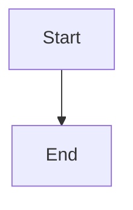

# Quickstart Guide: Revision Notes Frontend

**Feature Branch**: `003-revision-notes-frontend` | **Date**: 2025-11-10
**Target Audience**: Frontend developers implementing revision notes UI

---

## Table of Contents

1. [Prerequisites](#prerequisites)
2. [Installation](#installation)
3. [Architecture Overview](#architecture-overview)
4. [Implementation Workflow](#implementation-workflow)
5. [Component Integration](#component-integration)
6. [Testing Strategy](#testing-strategy)
7. [Common Patterns](#common-patterns)
8. [Troubleshooting](#troubleshooting)

---

## Prerequisites

### Required Knowledge
- React 18+ (hooks, context, state management)
- TypeScript (interfaces, generics, type narrowing)
- Next.js 13+ (app router, client components)
- Tailwind CSS (utility classes, responsive design)
- Appwrite SDK (databases, storage, authentication)

### Existing Codebase Familiarity
- **SessionChatAssistant** component architecture
- **ContextChatPanel** implementation (side panel resize pattern)
- **StudentDashboard** layout (course tabs, lesson lists)
- **DiagramDriver** pattern (Appwrite Storage integration)

### Backend Dependencies
- Revision notes generation system deployed (spec 002)
- `revision_notes` collection in Appwrite database
- Markdown files uploaded to Appwrite Storage `documents` bucket
- At least one course with generated cheat sheet and lesson notes

---

## Installation

### 1. Install npm Dependencies

```bash
cd assistant-ui-frontend
npm install --legacy-peer-deps react-markdown remark-math rehype-katex rehype-mermaid katex mermaid
```

**Package Versions**:
```json
{
  "react-markdown": "^9.0.1",
  "remark-math": "^6.0.0",
  "rehype-katex": "^7.0.0",
  "rehype-mermaid": "^2.1.0",
  "katex": "^0.16.9",
  "mermaid": "^10.6.1"
}
```

### 2. Import KaTeX CSS (Required for LaTeX Rendering)

Add to `app/layout.tsx` or global CSS:

```tsx
// app/layout.tsx
import 'katex/dist/katex.min.css';
```

### 3. Verify Appwrite Configuration

Ensure `.env.local` has correct Appwrite settings:

```bash
NEXT_PUBLIC_APPWRITE_ENDPOINT=https://cloud.appwrite.io/v1
NEXT_PUBLIC_APPWRITE_PROJECT_ID=your_project_id
```

---

## Architecture Overview

### Data Flow (Modal-Based)

```
User clicks "Course Cheat Sheet" button
  ↓
useCourseCheatSheet hook checks availability
  ↓
Modal opens with loading skeleton
  ↓
RevisionNotesDriver fetches markdown from Storage
  ↓
MarkdownRenderer displays content (LaTeX + Mermaid)
  ↓
User closes modal → cache cleared
```

### Data Flow (Side Panel)

```
SessionChatAssistant renders lesson
  ↓
User clicks "Lesson Notes" toggle
  ↓
useLessonNotesSidePanel fetches notes (first open only)
  ↓
Cache persists for entire lesson session
  ↓
Panel toggles use cached content (no refetch)
  ↓
Lesson ends → cache cleared
```

### Component Hierarchy

```
📦 assistant-ui-frontend/
├── components/
│   ├── revision-notes/
│   │   ├── MarkdownRenderer.tsx (core renderer)
│   │   ├── CourseCheatSheetModal.tsx (dashboard modal)
│   │   ├── LessonQuickNotesModal.tsx (dashboard modal)
│   │   ├── LessonNotesSidePanel.tsx (session side panel)
│   │   └── [utilities...]
│   ├── dashboard/
│   │   └── StudentDashboard.tsx (integrate cheat sheet button)
│   └── SessionChatAssistant.tsx (integrate side panel)
├── lib/
│   └── appwrite/
│       └── driver/
│           └── RevisionNotesDriver.ts
└── hooks/
    └── useRevisionNotes.ts
```

---

## Implementation Workflow

### Phase 1: Core Markdown Renderer (1-2 hours)

**File**: `components/revision-notes/MarkdownRenderer.tsx`

1. Create component with `react-markdown` + plugins
2. Configure Mermaid with error handling
3. Add responsive CSS classes
4. Test with sample markdown containing LaTeX and Mermaid

**Example Implementation**:

```tsx
'use client';

import ReactMarkdown from 'react-markdown';
import remarkMath from 'remark-math';
import rehypeKatex from 'rehype-katex';
import rehypeMermaid from 'rehype-mermaid';

export function MarkdownRenderer({ content }: { content: string }) {
  return (
    <div className="prose prose-sm md:prose-lg max-w-none">
      <ReactMarkdown
        remarkPlugins={[remarkMath]}
        rehypePlugins={[
          [rehypeKatex, { throwOnError: false, errorColor: '#cc0000' }],
          [rehypeMermaid, { strategy: 'img-svg' }]
        ]}
      >
        {content}
      </ReactMarkdown>
    </div>
  );
}
```

**Test Markdown**:
```markdown
# Test Heading

Inline math: $\frac{1}{2}$

Display math: $$E=mc^2$$


```

### Phase 2: Appwrite Driver (1 hour)

**File**: `lib/appwrite/driver/RevisionNotesDriver.ts`

1. Copy interface from `contracts/RevisionNotesDriver.ts`
2. Implement `getCourseCheatSheet()` method
3. Implement `getLessonQuickNotes()` method
4. Add error handling per constitution (fast-fail)

**Key Methods**:

```typescript
async getCourseCheatSheet(courseId: string): Promise<RevisionNoteContent> {
  const documentId = `revision_notes_${courseId}_cheat_sheet`;

  try {
    const document = await this.databases.getDocument(
      'default',
      'revision_notes',
      documentId
    );

    const markdown = await this.fetchMarkdownFile(document.markdownFileId);

    return {
      metadata: document,
      markdownContent: markdown,
      fileSize: markdown.length
    };
  } catch (error) {
    if (error.code === 404) {
      throw new RevisionNotesError(
        RevisionNotesErrorCode.FILE_NOT_FOUND,
        `Course cheat sheet not available for ${courseId}`,
        false // Not retryable
      );
    }
    throw new RevisionNotesError(
      RevisionNotesErrorCode.FETCH_FAILED,
      error.message,
      true // Retryable
    );
  }
}
```

### Phase 3: React Hooks (1-2 hours)

**File**: `hooks/useRevisionNotes.ts`

1. Implement `useCourseCheatSheet()` hook (modal lifecycle)
2. Implement `useLessonQuickNotes()` hook (modal lifecycle)
3. Implement `useLessonNotesSidePanel()` hook (session-scoped cache)

**Critical Pattern - Modal Cache Lifecycle**:

```typescript
export function useCourseCheatSheet(courseId: string, driver: RevisionNotesDriver) {
  const [isOpen, setIsOpen] = useState(false);
  const [content, setContent] = useState<RevisionNoteContent | null>(null);

  useEffect(() => {
    // Fetch on open (if not cached)
    if (isOpen && !content) {
      fetchContent();
    }

    // Clear cache on close
    if (!isOpen) {
      setContent(null);
    }
  }, [isOpen]);

  // ... rest of implementation
}
```

### Phase 4: Modal Components (2-3 hours)

**Files**:
- `components/revision-notes/CourseCheatSheetModal.tsx`
- `components/revision-notes/LessonQuickNotesModal.tsx`

1. Use Radix UI Dialog for accessible modals
2. Integrate hooks for state management
3. Add loading skeleton
4. Add error display with retry button

**Example Modal Structure**:

```tsx
import * as Dialog from '@radix-ui/react-dialog';

export function CourseCheatSheetModal({ isOpen, onClose, courseId }: Props) {
  const { content, status, error, handleRetry } = useCourseCheatSheet(courseId, driver);

  return (
    <Dialog.Root open={isOpen} onOpenChange={onClose}>
      <Dialog.Portal>
        <Dialog.Overlay className="fixed inset-0 bg-black/50" />
        <Dialog.Content className="fixed top-1/2 left-1/2 transform -translate-x-1/2 -translate-y-1/2 bg-white rounded-lg shadow-xl max-w-4xl w-full max-h-[90vh] overflow-y-auto p-6">
          <Dialog.Title className="text-2xl font-bold mb-4">
            Course Cheat Sheet
          </Dialog.Title>

          {status === 'loading' && <RevisionNotesLoadingSkeleton noteType="cheat_sheet" />}

          {status === 'success' && content && (
            <MarkdownRenderer content={content.markdownContent} />
          )}

          {status === 'error' && error && (
            <RevisionNotesErrorDisplay error={error} onRetry={handleRetry} />
          )}

          <Dialog.Close asChild>
            <button className="mt-4 px-4 py-2 bg-gray-200 rounded">Close</button>
          </Dialog.Close>
        </Dialog.Content>
      </Dialog.Portal>
    </Dialog.Root>
  );
}
```

### Phase 5: Dashboard Integration (1 hour)

**File**: `components/dashboard/StudentDashboard.tsx`

1. Add `<CourseCheatSheetButton>` to course tab header
2. Check availability using driver before enabling button
3. Render modal when button clicked

**Integration Point**:

```tsx
// In CourseTabContent component
<div className="course-header flex justify-between items-center mb-4">
  <h2 className="text-xl font-bold">{course.subject}</h2>

  {/* NEW: Course Cheat Sheet Button */}
  <CourseCheatSheetButton
    courseId={course.courseId}
    isAvailable={cheatSheetAvailable}
    onClick={openCheatSheetModal}
  />
</div>

{/* NEW: Course Cheat Sheet Modal */}
<CourseCheatSheetModal
  isOpen={isCheatSheetModalOpen}
  onClose={closeCheatSheetModal}
  courseId={course.courseId}
  courseTitle={course.subject}
/>
```

### Phase 6: Lesson List Integration (1 hour)

**File**: `components/dashboard/CourseCurriculum.tsx` (or similar)

1. Add `<LessonQuickNotesButton>` to each lesson list item
2. Check availability per lesson
3. Render modal when button clicked

**Integration Point**:

```tsx
// In LessonListItem component
<div className="lesson-item flex justify-between items-center p-3 border rounded mb-2">
  <div>
    <h3 className="font-medium">{lesson.title}</h3>
    <p className="text-sm text-gray-600">Lesson {lesson.order}</p>
  </div>

  <div className="flex gap-2">
    {/* Existing buttons */}
    <button>Start Lesson</button>
    <button>View History</button>

    {/* NEW: Lesson Quick Notes Button */}
    <LessonQuickNotesButton
      courseId={courseId}
      lessonOrder={lesson.order}
      isAvailable={lessonNotesAvailable}
      onClick={openLessonNotesModal}
    />
  </div>
</div>

{/* NEW: Lesson Quick Notes Modal */}
<LessonQuickNotesModal
  isOpen={isLessonNotesModalOpen}
  onClose={closeLessonNotesModal}
  courseId={courseId}
  lessonOrder={lesson.order}
  lessonTitle={lesson.title}
/>
```

### Phase 7: SessionChatAssistant Side Panel (2-3 hours)

**File**: `components/SessionChatAssistant.tsx`

1. Add `useLessonNotesSidePanel()` hook
2. Extract shared resize logic into `useSidePanelResize()` hook
3. Implement mutual exclusivity (LessonNotes vs ContextChat)
4. Add `<LessonNotesToggleButton>` to UI
5. Render `<LessonNotesSidePanel>` component

**Integration Pattern**:

```tsx
export function SessionChatAssistant({ sessionId }: Props) {
  const {
    activeSidePanel,
    openLessonNotes,
    openContextChat,
    closePanel,
    panelWidth,
    setPanelWidth,
    content: lessonNotesContent
  } = useLessonNotesSidePanel(sessionId, courseId, lessonOrder, driver);

  return (
    <div className="flex h-screen">
      {/* Main teaching panel */}
      <div className={`flex-1 ${activeSidePanel !== 'none' ? 'mr-4' : ''}`}>
        <SessionHeader />
        <MyAssistant sessionContext={sessionContext} />

        {/* NEW: Lesson Notes Toggle Button */}
        <LessonNotesToggleButton
          isOpen={activeSidePanel === 'lesson_notes'}
          onClick={activeSidePanel === 'lesson_notes' ? closePanel : openLessonNotes}
        />
      </div>

      {/* Side panels (mutual exclusivity) */}
      {activeSidePanel === 'context_chat' && (
        <ContextChatPanel
          isOpen={true}
          onClose={closePanel}
          width={panelWidth}
          onWidthChange={setPanelWidth}
        />
      )}

      {activeSidePanel === 'lesson_notes' && (
        <LessonNotesSidePanel
          isOpen={true}
          onClose={closePanel}
          sessionId={sessionId}
          courseId={courseId}
          lessonOrder={lessonOrder}
          panelWidth={panelWidth}
          onWidthChange={setPanelWidth}
        />
      )}
    </div>
  );
}
```

---

## Component Integration

### Adding Components to Existing Pages

#### 1. EnhancedStudentDashboard

**Location**: `app/(protected)/dashboard/page.tsx`

**Changes Required**:
- Import `CourseCheatSheetButton` and `CourseCheatSheetModal`
- Add button to course tab header section
- Manage modal state per course

**Lines to Modify**: Course tab header rendering (~line 150-200 depending on current structure)

#### 2. CourseCurriculum (Lesson List)

**Location**: Likely `components/dashboard/CourseCurriculum.tsx` or similar

**Changes Required**:
- Import `LessonQuickNotesButton` and `LessonQuickNotesModal`
- Add button to each lesson list item
- Manage modal state per lesson

**Lines to Modify**: Lesson list item rendering

#### 3. SessionChatAssistant

**Location**: `components/SessionChatAssistant.tsx`

**Changes Required**:
- Import `useLessonNotesSidePanel` hook
- Import `LessonNotesSidePanel` and `LessonNotesToggleButton`
- Add side panel state management
- Implement mutual exclusivity with ContextChat
- Add toggle button to UI
- Render side panel conditionally

**Lines to Modify**: Main layout rendering, side panel conditional logic

---

## Testing Strategy

### Unit Testing (Components)

**Test File**: `components/revision-notes/__tests__/MarkdownRenderer.test.tsx`

```typescript
import { render, screen } from '@testing-library/react';
import { MarkdownRenderer } from '../MarkdownRenderer';

describe('MarkdownRenderer', () => {
  it('renders LaTeX math expressions', () => {
    const content = 'Inline math: $\\frac{1}{2}$';
    render(<MarkdownRenderer content={content} />);

    // KaTeX should render fraction
    expect(screen.getByText(/frac/)).toBeInTheDocument();
  });

  it('renders Mermaid diagrams', () => {
    const content = '```mermaid\ngraph TD\nA-->B\n```';
    render(<MarkdownRenderer content={content} />);

    // Mermaid should generate SVG
    expect(screen.getByRole('img')).toBeInTheDocument();
  });

  it('handles malformed LaTeX gracefully', () => {
    const content = 'Bad math: $\\frac{incomplete$';
    render(<MarkdownRenderer content={content} />);

    // Should not crash, display raw LaTeX
    expect(screen.getByText(/frac/)).toBeInTheDocument();
  });
});
```

### Integration Testing (Hooks)

**Test File**: `hooks/__tests__/useRevisionNotes.test.tsx`

```typescript
import { renderHook, act, waitFor } from '@testing-library/react';
import { useCourseCheatSheet } from '../useRevisionNotes';

describe('useCourseCheatSheet', () => {
  it('fetches cheat sheet when modal opens', async () => {
    const mockDriver = {
      getCourseCheatSheet: jest.fn().mockResolvedValue({
        markdownContent: '# Cheat Sheet',
        fileSize: 100
      })
    };

    const { result } = renderHook(() =>
      useCourseCheatSheet('course_123', mockDriver)
    );

    act(() => {
      result.current.openModal();
    });

    await waitFor(() => {
      expect(result.current.status).toBe('success');
    });

    expect(mockDriver.getCourseCheatSheet).toHaveBeenCalledWith('course_123');
  });

  it('clears cache when modal closes', async () => {
    const { result } = renderHook(() =>
      useCourseCheatSheet('course_123', mockDriver)
    );

    // Open and fetch content
    act(() => result.current.openModal());
    await waitFor(() => expect(result.current.status).toBe('success'));

    // Close modal
    act(() => result.current.closeModal());

    expect(result.current.content).toBeNull();
  });
});
```

### Manual Testing with Playwright (Required per Constitution)

**Test Credentials**: `test@scottishailessons.com` / `red12345`

**Test Scenarios**:

1. **Course Cheat Sheet Flow**:
   ```bash
   # Start application
   cd langgraph-agent && ./start.sh

   # Use Playwright MCP tool
   1. Navigate to http://localhost:3000/dashboard
   2. Click course tab for enrolled course
   3. Click "Course Cheat Sheet" button
   4. Verify modal opens with markdown content
   5. Verify LaTeX renders (look for fractions, equations)
   6. Verify Mermaid diagrams render
   7. Close modal
   8. Reopen modal
   9. Verify content loads from cache (instant display)
   10. Close and reopen again
   11. Verify fresh fetch (loading skeleton appears briefly)
   ```

2. **Lesson Quick Notes Flow**:
   ```bash
   1. Navigate to course curriculum
   2. Click "Lesson Notes" button for a lesson
   3. Verify modal opens with lesson-specific content
   4. Verify markdown structure (sections match spec 002 format)
   5. Close modal
   ```

3. **Side Panel Flow**:
   ```bash
   1. Start a lesson session
   2. Click "Lesson Notes" toggle button
   3. Verify side panel opens on right side
   4. Verify markdown content displays
   5. Drag resize handle
   6. Verify panel resizes between 20%-50% width
   7. Toggle panel closed
   8. Reopen panel
   9. Verify content loads from cache (no loading state)
   10. Open Context Chat panel
   11. Verify Lesson Notes auto-collapses (mutual exclusivity)
   12. Complete lesson
   13. Start new lesson
   14. Verify cache cleared (loading state on first open)
   ```

---

## Common Patterns

### Pattern 1: Modal Cache Lifecycle

**Problem**: How to fetch fresh content on each modal open while caching during viewing?

**Solution**:
```typescript
useEffect(() => {
  if (isOpen && !content && status === 'idle') {
    fetchContent(); // Fetch on open if no cache
  }

  if (!isOpen && content) {
    setContent(null); // Clear cache on close
    setStatus('idle');
  }
}, [isOpen]);
```

### Pattern 2: Session-Scoped Cache

**Problem**: How to cache content for entire lesson session but clear on session end?

**Solution**:
```typescript
const contentCacheRef = useRef<string | null>(null);

useEffect(() => {
  return () => {
    contentCacheRef.current = null; // Clear on unmount (session end)
  };
}, [sessionId]); // Re-run cleanup when sessionId changes
```

### Pattern 3: Exponential Backoff Hint

**Problem**: How to prevent retry spam without blocking retries?

**Solution**:
```typescript
const handleRetry = () => {
  const now = Date.now();
  const timeSinceLastRetry = now - lastRetryTime;

  if (retryCount >= 3 && timeSinceLastRetry < 30000) {
    setShowBackoffHint(true); // Hint after 3 rapid retries
  }

  setRetryCount(prev => prev + 1);
  setLastRetryTime(now);
  fetchContent();
};
```

### Pattern 4: Mutual Exclusivity (Side Panels)

**Problem**: How to ensure only one side panel is open at a time?

**Solution**:
```typescript
enum ActiveSidePanel {
  None = 'none',
  ContextChat = 'context_chat',
  LessonNotes = 'lesson_notes'
}

const [activeSidePanel, setActiveSidePanel] = useState(ActiveSidePanel.None);

const openLessonNotes = () => setActiveSidePanel(ActiveSidePanel.LessonNotes);
const openContextChat = () => setActiveSidePanel(ActiveSidePanel.ContextChat);

// Render logic
{activeSidePanel === 'context_chat' && <ContextChatPanel />}
{activeSidePanel === 'lesson_notes' && <LessonNotesSidePanel />}
```

---

## Troubleshooting

### Issue: LaTeX Renders as Plain Text

**Symptom**: Math expressions like `$\frac{1}{2}$` display literally instead of rendering

**Cause**: Missing KaTeX CSS import

**Solution**:
```tsx
// Add to app/layout.tsx
import 'katex/dist/katex.min.css';
```

### Issue: Mermaid Diagrams Don't Render

**Symptom**: Mermaid code blocks display as text, no diagrams

**Cause 1**: `rehype-mermaid` plugin not configured
**Solution**: Verify plugin in `rehypePlugins` array

**Cause 2**: Mermaid not initialized
**Solution**: Add to component:
```typescript
import mermaid from 'mermaid';

useEffect(() => {
  mermaid.initialize({
    startOnLoad: true,
    theme: 'default',
    securityLevel: 'loose'
  });
}, []);
```

### Issue: Modal Not Closing on Background Click

**Symptom**: Clicking overlay doesn't close modal

**Cause**: Missing `onOpenChange` handler

**Solution**:
```tsx
<Dialog.Root open={isOpen} onOpenChange={setIsOpen}>
  {/* onOpenChange handles both close button AND overlay clicks */}
</Dialog.Root>
```

### Issue: Side Panel Cache Not Clearing

**Symptom**: Old lesson notes show when starting new lesson

**Cause**: Cache cleanup not tied to `sessionId`

**Solution**:
```typescript
useEffect(() => {
  return () => {
    contentCacheRef.current = null;
  };
}, [sessionId]); // Key by sessionId, not generic empty array
```

### Issue: "Revision Notes Not Available" for All Courses

**Symptom**: All courses show "not available" message

**Cause**: Backend revision notes not generated OR incorrect document ID format

**Solution**:
1. Verify backend has run for at least one course
2. Check Appwrite console for `revision_notes` collection documents
3. Verify document IDs match format: `revision_notes_{courseId}_cheat_sheet`
4. Check browser console for 404 errors vs network errors

---

## Next Steps

After completing all implementation phases:

1. **Run Manual Tests**: Use Playwright to verify all user scenarios from spec
2. **Update Agent Context**: Run `.specify/scripts/bash/update-agent-context.sh claude`
3. **Create Tasks**: Run `/speckit.tasks` to generate actionable task list
4. **Code Review**: Verify constitution compliance (no fallbacks, error logging, modular code)

For detailed implementation planning, see `tasks.md` (generated by `/speckit.tasks` command).
