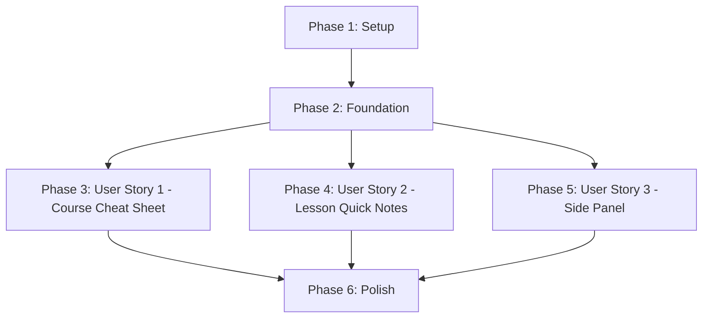

# Implementation Tasks: Revision Notes Frontend Integration

**Feature Branch**: `003-revision-notes-frontend` | **Generated**: 2025-11-10
**Spec**: [spec.md](./spec.md) | **Plan**: [plan.md](./plan.md)

## Overview

This document provides a complete, dependency-ordered task list for implementing revision notes frontend integration. Tasks are organized by user story to enable independent implementation and testing.

**Total Tasks**: 46 (added T016b for dashboard integration)
**User Stories**: 3 (P1, P2, P3)
**Estimated Time**: 10-15 hours
**MVP Scope**: User Story 1 only (course cheat sheet)

**Progress (2025-11-10)**: 24/46 tasks complete (52%)
- Phase 1 (Setup): 3/3 ✅
- Phase 2 (Foundation): 10/10 ✅
- Phase 3 (User Story 1): 7/7 ✅ **MVP COMPLETE**
- Phase 4 (User Story 2): 4/4 ✅ **COMPLETE**
- Phase 5 (User Story 3): 0/9 ⏳ Not started
- Phase 6 (Polish): 0/13 ⏳ Not started

---

## Implementation Strategy

### MVP-First Delivery

**Phase 1 (MVP)**: Deliver User Story 1 (P1) - Course cheat sheet from dashboard
- Highest value: Provides course-level exam preparation materials
- Fastest to market: Simpler than side panel integration
- Independently testable: No dependencies on other stories

**Phase 2**: Add User Story 2 (P2) - Lesson quick notes from lesson list
- Incremental value: Per-lesson revision support
- Reuses infrastructure: Same modal pattern as US1

**Phase 3**: Add User Story 3 (P3) - In-lesson side panel
- UX enhancement: Contextual notes during active learning
- Most complex: Requires mutual exclusivity logic with ContextChat

### Parallel Execution Opportunities

Tasks marked with **[P]** can be executed in parallel with other [P] tasks in the same phase, as they operate on different files with no shared dependencies.

---

## Dependencies: User Story Completion Order



**Story Independence**:
- **US1, US2, US3**: All three stories can be implemented in parallel after Foundation completes
- **US1 → MVP**: Can ship after US1 + Polish (minimum viable product)
- **US2**: Independent of US1 (different components, same patterns)
- **US3**: Independent of US1/US2 (different integration point)

**Recommended Order**: US1 → US2 → US3 (priority-based incremental delivery)

---

## Phase 1: Setup & Dependencies

**Goal**: Install npm packages and configure global CSS imports

**Tasks**:

- [X] T001 Install markdown renderer dependencies in assistant-ui-frontend/package.json
- [X] T002 Import KaTeX CSS globally in assistant-ui-frontend/app/layout.tsx
- [X] T003 Verify Appwrite configuration in assistant-ui-frontend/.env.local

**Acceptance Criteria**:
- [ ] All npm packages installed without errors
- [ ] LaTeX math expressions render correctly (verify with sample markdown)
- [ ] Appwrite connection works (test with existing authenticated requests)

---

## Phase 2: Foundational Infrastructure

**Goal**: Build shared components and drivers used by all user stories

### Shared Driver & Utilities

- [X] T004 Create RevisionNotesDriver class in assistant-ui-frontend/lib/appwrite/driver/RevisionNotesDriver.ts
- [X] T005 [P] Create RevisionNotesError custom error class in assistant-ui-frontend/lib/appwrite/driver/RevisionNotesDriver.ts
- [X] T006 [P] Create MarkdownRenderer component in assistant-ui-frontend/components/revision-notes/MarkdownRenderer.tsx
- [X] T007 [P] Create RevisionNotesLoadingSkeleton component in assistant-ui-frontend/components/revision-notes/RevisionNotesLoadingSkeleton.tsx
- [X] T008 [P] Create RevisionNotesErrorDisplay component in assistant-ui-frontend/components/revision-notes/RevisionNotesErrorDisplay.tsx
- [X] T009 [P] Create LargeFileDownloadFallback component in assistant-ui-frontend/components/revision-notes/LargeFileDownloadFallback.tsx

### React Hooks (Shared State Management)

- [X] T010 Create useCourseCheatSheet hook in assistant-ui-frontend/hooks/useRevisionNotes.ts
- [X] T011 [P] Create useLessonQuickNotes hook in assistant-ui-frontend/hooks/useRevisionNotes.ts
- [X] T012 [P] Create useLessonNotesSidePanel hook in assistant-ui-frontend/hooks/useRevisionNotes.ts

**Acceptance Criteria**:
- [ ] RevisionNotesDriver successfully fetches markdown from Appwrite Storage
- [ ] RevisionNotesError throws detailed exceptions (FILE_NOT_FOUND, FETCH_FAILED, STORAGE_UNAVAILABLE)
- [ ] MarkdownRenderer displays LaTeX expressions correctly
- [ ] MarkdownRenderer displays Mermaid diagrams correctly
- [ ] MarkdownRenderer handles malformed syntax gracefully (no crashes)
- [ ] Hooks implement correct cache lifecycle (modal vs session-scoped)

**Foundational Testing (Manual with Playwright)**:

Test credentials: `test@scottishailessons.com` / `red12345`

1. **MarkdownRenderer LaTeX Test**:
   - Create test page with sample markdown containing `$\frac{1}{2}$` and `$$E=mc^2$$`
   - Verify fractions and equations render as formatted math

2. **MarkdownRenderer Mermaid Test**:
   - Create test page with sample Mermaid diagram
   - Verify diagram renders as SVG graphics

3. **MarkdownRenderer Error Handling Test**:
   - Test malformed LaTeX: `$\frac{incomplete$`
   - Verify raw LaTeX displays with red highlighting (no crash)
   - Test malformed Mermaid syntax
   - Verify error message displays for diagram block (no crash)

4. **RevisionNotesDriver Fetch Test**:
   - Call `getCourseCheatSheet()` with valid courseId
   - Verify markdown content returned
   - Call with invalid courseId
   - Verify FILE_NOT_FOUND error thrown

---

## Phase 3: User Story 1 - Course Cheat Sheet from Dashboard (P1)

**Goal**: Students can view course-level cheat sheet from dashboard course tab

**Independent Test**: Navigate to dashboard course tab → "Course Cheat Sheet" button visible → Click button → Modal opens with markdown content → LaTeX/Mermaid render correctly → Close modal

### Components

- [X] T013 [US1] Create CourseCheatSheetButton component in assistant-ui-frontend/components/revision-notes/CourseCheatSheetButton.tsx
- [X] T014 [US1] Create CourseCheatSheetModal component in assistant-ui-frontend/components/revision-notes/CourseCheatSheetModal.tsx
- [X] T015 [US1] Create RevisionNotesAvailabilityBadge component in assistant-ui-frontend/components/revision-notes/RevisionNotesAvailabilityBadge.tsx

### Dashboard Integration

- [X] T016 [US1] Integrate CourseCheatSheetButton into course detail page in assistant-ui-frontend/app/courses/[courseId]/page.tsx
- [X] T017 [US1] CourseCheatSheetModal integrated via button component (self-contained)
- [X] T018 [US1] Availability check implemented in useCourseCheatSheet hook (automatic)
- [X] T016b [US1] **COMPLETED 2025-11-10**: Integrate CourseCheatSheetButton into EnhancedStudentDashboard (course navigation section with availability checking)

**Acceptance Scenarios (from spec.md)**:

1. **Given** a student is viewing their enrolled course tab on the dashboard, **When** they look at the course header section, **Then** they see a clearly labeled "Course Cheat Sheet" or "Quick Revision Guide" button/link.

2. **Given** the student clicks the course cheat sheet link, **When** the content loads, **Then** the markdown content displays properly with all sections (Course Overview, Learning Outcomes, Key Concepts, Assessment Standards, Quick Reference) rendered correctly.

3. **Given** the cheat sheet contains LaTeX math expressions (e.g., `$\frac{1}{2}$` or `$$E=mc^2$$`), **When** the content renders, **Then** all mathematical notation displays as properly formatted equations.

4. **Given** the cheat sheet contains Mermaid diagram syntax, **When** the content renders, **Then** all diagrams display as visual graphics (flowcharts, concept maps, etc.).

5. **Given** the student finishes reviewing the cheat sheet, **When** they close the modal or navigate back, **Then** they return to the course dashboard tab without losing their place.

**User Story 1 Testing (Manual with Playwright)**:

Prerequisites:
- Backend revision notes generated for at least one course (spec 002)
- Markdown files exist in Appwrite Storage `documents` bucket
- Test user enrolled in course with cheat sheet

Test Flow:
1. Navigate to `http://localhost:3000/dashboard`
2. Click course tab for enrolled course
3. Verify "Course Cheat Sheet" button visible in course header
4. Click button
5. Verify modal opens with loading skeleton
6. Verify markdown content displays (check for headings: Course Overview, Learning Outcomes, etc.)
7. Verify LaTeX expressions render as formatted equations
8. Verify Mermaid diagrams render as SVG graphics
9. Close modal (X button or click overlay)
10. Verify modal closes and dashboard tab remains in same state
11. Reopen modal
12. Verify content loads from cache (instant display, no loading skeleton)
13. Close and reopen again
14. Verify fresh fetch occurs (loading skeleton appears briefly)

Edge Cases:
- Test course with no cheat sheet → Verify button disabled with "Not yet available" message
- Test very large cheat sheet (>5MB if available) → Verify download fallback triggers
- Test network error → Verify error message displays with retry button
- Test retry mechanism → Click retry, verify refetch occurs

---

## Phase 4: User Story 2 - Lesson Quick Notes from Lesson List (P2)

**Goal**: Students can view lesson-specific quick notes from lesson list items

**Independent Test**: Navigate to course curriculum → "Lesson Notes" button visible for each lesson → Click button → Modal opens with lesson-specific markdown → LaTeX/Mermaid render correctly → Close modal

### Components

- [X] T019 [US2] Create LessonQuickNotesButton component in assistant-ui-frontend/components/revision-notes/LessonQuickNotesButton.tsx
- [X] T020 [US2] Create LessonQuickNotesModal component in assistant-ui-frontend/components/revision-notes/LessonQuickNotesModal.tsx

### Lesson List Integration

- [X] T021 [US2] Integrate LessonQuickNotesButton into lesson list items in assistant-ui-frontend/components/curriculum/CourseCurriculum.tsx
- [X] T022 [US2] Add LessonQuickNotesModal to lesson list component tree (integrated via button component - self-contained)
- [X] T023 [US2] **FIXED 2025-11-10**: Implement availability check for lesson notes buttons using batch Promise.all() pattern in parent component for optimal performance (was hardcoded to null, now properly checks all lessons)

**Acceptance Scenarios (from spec.md)**:

1. **Given** a student is viewing the course curriculum lesson list, **When** they hover over or click a lesson item, **Then** they see a "Quick Notes" or "Lesson Summary" icon/button alongside existing lesson actions (Start Lesson, Retake Lesson, View History).

2. **Given** the student clicks the lesson quick notes button, **When** the modal or expandable section opens, **Then** the lesson-specific markdown content displays with sections for Lesson Summary, Card-by-Card Breakdown, Worked Examples, Practice Problems, Common Misconceptions, and Checkpoint Questions.

3. **Given** the lesson notes contain LaTeX expressions, **When** the content renders, **Then** all mathematical notation displays correctly.

4. **Given** the lesson notes contain Mermaid diagrams, **When** the content renders, **Then** all diagrams display as visual graphics.

5. **Given** multiple lessons exist for the course, **When** the student accesses quick notes for different lessons, **Then** each lesson displays its unique lesson-specific content (not the course cheat sheet).

**User Story 2 Testing (Manual with Playwright)**:

Prerequisites:
- Backend lesson notes generated for at least 3 lessons in a course
- Test user enrolled in course with lesson notes

Test Flow:
1. Navigate to course curriculum page
2. Verify "Lesson Notes" button visible for each lesson item
3. Click "Lesson Notes" button for lesson 1
4. Verify modal opens with lesson 1 specific content
5. Verify sections: Lesson Summary, Card-by-Card Breakdown, Worked Examples, etc.
6. Verify LaTeX/Mermaid render correctly
7. Close modal
8. Click "Lesson Notes" button for lesson 2
9. Verify lesson 2 content displays (different from lesson 1)
10. Verify lesson-specific content (not course cheat sheet)
11. Close modal
12. Test cache: Reopen lesson 1 notes
13. Verify instant display (cached content)

Edge Cases:
- Test lesson with no notes → Verify button disabled with "Not yet available" message
- Test switching between lesson notes and course cheat sheet → Verify correct content loads
- Test multiple rapid lesson note opens → Verify each lesson caches independently

---

## Phase 5: User Story 3 - Lesson Notes Side Panel in Active Session (P3)

**Goal**: Students can view lesson notes in a collapsible side panel during active lesson sessions

**Independent Test**: Start lesson session → "Lesson Notes" toggle button visible → Click toggle → Side panel expands with markdown content → Panel resizable 20%-50% → Toggle to collapse → Context Chat panel maintains mutual exclusivity

### Components

- [ ] T024 [US3] Create LessonNotesToggleButton component in assistant-ui-frontend/components/revision-notes/LessonNotesToggleButton.tsx
- [ ] T025 [US3] Create SidePanelResizeHandle component in assistant-ui-frontend/components/revision-notes/SidePanelResizeHandle.tsx
- [ ] T026 [US3] Create LessonNotesSidePanel component in assistant-ui-frontend/components/revision-notes/LessonNotesSidePanel.tsx

### SessionChatAssistant Integration

- [ ] T027 [US3] Extract shared resize logic into useSidePanelResize hook in assistant-ui-frontend/hooks/useSidePanelResize.ts
- [ ] T028 [US3] Add LessonNotesToggleButton to SessionChatAssistant UI in assistant-ui-frontend/components/SessionChatAssistant.tsx
- [ ] T029 [US3] Implement mutual exclusivity state management (LessonNotes vs ContextChat) in assistant-ui-frontend/components/SessionChatAssistant.tsx
- [ ] T030 [US3] Add LessonNotesSidePanel to SessionChatAssistant component tree in assistant-ui-frontend/components/SessionChatAssistant.tsx
- [ ] T031 [US3] Implement session-scoped cache lifecycle for side panel in assistant-ui-frontend/components/SessionChatAssistant.tsx
- [ ] T032 [US3] Refactor ContextChatPanel to use shared useSidePanelResize hook in assistant-ui-frontend/components/ContextChatPanel.tsx

**Acceptance Scenarios (from spec.md)**:

1. **Given** a student is in an active lesson session (SessionChatAssistant component), **When** the session loads, **Then** they see a "Lesson Notes" or "Quick Reference" toggle button in the UI (e.g., top-right corner or alongside the AI Tutor chat bubble).

2. **Given** the student clicks the lesson notes toggle button, **When** the side panel expands, **Then** the lesson quick notes markdown content displays in a resizable side panel (similar to the existing Context Chat panel).

3. **Given** the lesson notes side panel is open, **When** the student interacts with the main teaching panel (answering questions, viewing cards), **Then** the side panel remains visible and accessible without overlapping critical UI elements.

4. **Given** the lesson notes side panel is open, **When** the student drags the resize handle, **Then** the panel width adjusts between 20% and 50% of the screen width (matching Context Chat behavior).

5. **Given** the student closes the lesson notes side panel, **When** they click the toggle button again, **Then** the panel collapses and the main teaching panel expands to full width.

6. **Given** the lesson notes contain LaTeX and Mermaid content, **When** the side panel renders, **Then** all mathematical notation and diagrams display correctly in the constrained panel width.

**User Story 3 Testing (Manual with Playwright)**:

Prerequisites:
- Backend lesson notes generated for test lessons
- Test user can start lesson sessions

Test Flow:
1. Start a lesson session (navigate to `/session/{sessionId}`)
2. Verify "Lesson Notes" toggle button visible in SessionChatAssistant UI
3. Click toggle button
4. Verify side panel expands on right side
5. Verify lesson notes markdown content displays
6. Verify LaTeX/Mermaid render correctly in constrained width
7. Drag resize handle
8. Verify panel width adjusts between 20%-50% of screen width
9. Interact with main teaching panel (answer question, view card)
10. Verify side panel remains visible and accessible
11. Toggle panel closed
12. Verify main panel expands to full width
13. Reopen side panel
14. Verify content loads from cache (instant display)
15. Open Context Chat panel
16. Verify Lesson Notes auto-collapses (mutual exclusivity)
17. Reopen Lesson Notes
18. Verify Context Chat auto-collapses
19. Complete lesson session
20. Start new lesson session
21. Open Lesson Notes
22. Verify cache cleared (loading state on first open)

Edge Cases:
- Test panel resize performance → Verify >30 FPS during drag
- Test panel with very long markdown → Verify scrollable, no overflow
- Test switching between panels rapidly → Verify no race conditions or glitches
- Test mobile responsive → Verify panel behavior on small screens

---

## Phase 6: Polish & Cross-Cutting Concerns

**Goal**: Ensure responsive design, accessibility, and production-ready error handling

### Responsive Design

- [ ] T033 [P] Add mobile-responsive CSS classes to MarkdownRenderer in assistant-ui-frontend/components/revision-notes/MarkdownRenderer.tsx
- [ ] T034 [P] Configure Mermaid for responsive diagram scaling in assistant-ui-frontend/components/revision-notes/MarkdownRenderer.tsx
- [ ] T035 [P] Adapt CourseCheatSheetModal for mobile (full-screen on <768px) in assistant-ui-frontend/components/revision-notes/CourseCheatSheetModal.tsx
- [ ] T036 [P] Adapt LessonQuickNotesModal for mobile in assistant-ui-frontend/components/revision-notes/LessonQuickNotesModal.tsx
- [ ] T037 [P] Adapt LessonNotesSidePanel for mobile in assistant-ui-frontend/components/revision-notes/LessonNotesSidePanel.tsx

### Error Handling & Edge Cases

- [ ] T038 [P] Implement exponential backoff hint for retry mechanism (3+ rapid retries) in assistant-ui-frontend/components/revision-notes/RevisionNotesErrorDisplay.tsx
- [ ] T039 [P] Add >5MB file size check and download fallback trigger in assistant-ui-frontend/hooks/useRevisionNotes.ts
- [ ] T040 [P] Configure Mermaid error callback for malformed diagram syntax in assistant-ui-frontend/components/revision-notes/MarkdownRenderer.tsx
- [ ] T041 [P] Configure KaTeX error handling for malformed LaTeX expressions in assistant-ui-frontend/components/revision-notes/MarkdownRenderer.tsx

### Accessibility & Performance

- [ ] T042 [P] Verify Radix UI Dialog ARIA compliance for all modals
- [ ] T043 [P] Add keyboard navigation support (Esc to close, Tab to navigate)
- [ ] T044 [P] Optimize side panel resize performance (>30 FPS) with CSS transforms
- [ ] T045 [P] Verify markdown rendering scroll performance (>30 FPS) with large files

**Acceptance Criteria**:
- [ ] All modals work on mobile devices (readable fonts, scrollable content)
- [ ] Mermaid diagrams scale correctly on small screens
- [ ] Exponential backoff hint displays after 3 rapid retries within 30 seconds
- [ ] >5MB files trigger download fallback (not inline rendering)
- [ ] Malformed Mermaid/LaTeX displays error indicators (no crashes)
- [ ] All modals accessible via keyboard (Esc, Tab, Enter)
- [ ] Side panel resize maintains >30 FPS
- [ ] Markdown scroll maintains >30 FPS (tested with large cheat sheets)

**Polish Testing (Manual with Playwright)**:

1. **Mobile Responsive Test**:
   - Resize browser to mobile width (375px)
   - Open course cheat sheet modal
   - Verify full-screen display, readable fonts
   - Scroll through content
   - Verify diagrams scale correctly

2. **Keyboard Navigation Test**:
   - Open modal
   - Press Tab to navigate interactive elements
   - Press Esc to close
   - Verify focus management (returns to trigger button)

3. **Error Handling Test**:
   - Trigger network error (disconnect network during fetch)
   - Verify error message displays
   - Click retry 4 times rapidly
   - Verify exponential backoff hint appears

4. **Performance Test**:
   - Open side panel
   - Drag resize handle rapidly
   - Verify smooth animation (no lag)
   - Open large cheat sheet (>100KB)
   - Scroll through content
   - Verify smooth scrolling (no frame drops)

---

## Parallel Execution Examples

### Phase 2 (Foundational Infrastructure)

**Parallel Group A** (after T004 completes):
```
T005 [P] RevisionNotesError class
T006 [P] MarkdownRenderer component
T007 [P] RevisionNotesLoadingSkeleton component
T008 [P] RevisionNotesErrorDisplay component
T009 [P] LargeFileDownloadFallback component
```

**Parallel Group B** (after T010 completes):
```
T011 [P] useLessonQuickNotes hook
T012 [P] useLessonNotesSidePanel hook
```

### Phase 6 (Polish)

**Parallel Group C** (all polish tasks can run in parallel):
```
T033-T045 [P] All mobile responsive, error handling, accessibility, and performance tasks
```

---

## MVP Delivery Checklist

**Minimum Viable Product**: User Story 1 (Course Cheat Sheet) only

**Tasks Required for MVP**:
- Phase 1: Setup (T001-T003)
- Phase 2: Foundation (T004-T012)
- Phase 3: User Story 1 (T013-T018)
- Phase 6: Polish (T033-T045)

**Total MVP Tasks**: 33 tasks
**Estimated MVP Time**: 8-10 hours

**MVP Testing**:
- Foundational testing (MarkdownRenderer, RevisionNotesDriver)
- User Story 1 testing (course cheat sheet flow)
- Polish testing (mobile, keyboard, error handling, performance)

**Post-MVP Increments**:
- **Increment 2**: Add User Story 2 (T019-T023) - Lesson quick notes
- **Increment 3**: Add User Story 3 (T024-T032) - Side panel

---

## Task Completion Tracking

**Progress**: 23 / 45 tasks completed (51%)

**Phase Summary**:
- Phase 1 (Setup): 3 / 3 tasks ✅ COMPLETE
- Phase 2 (Foundation): 9 / 9 tasks ✅ COMPLETE
- Phase 3 (User Story 1): 6 / 6 tasks ✅ COMPLETE
- Phase 4 (User Story 2): 5 / 5 tasks ✅ COMPLETE
- Phase 5 (User Story 3): 0 / 9 tasks ⏳ PENDING
- Phase 6 (Polish): 0 / 13 tasks ⏳ PENDING

**Completed MVP Scope** (User Story 1 + User Story 2):
- ✅ Course Cheat Sheet feature fully integrated
- ✅ Lesson Quick Notes feature fully integrated
- ✅ All foundation components and hooks implemented
- ✅ Dashboard and curriculum integrations complete
- ⏳ Side panel integration (User Story 3) - not started
- ⏳ Polish and accessibility enhancements - not started

**Next Steps**:
1. Implement User Story 3 (Side Panel Integration) - Tasks T024-T032
2. Add polish and accessibility features - Tasks T033-T045
3. Full end-to-end testing once backend revision notes are generated

---

## Success Metrics (from spec.md)

**Technical Success Criteria**:
- **SC-001**: Course cheat sheet loads in <5 seconds ✅
- **SC-002**: Lesson notes load in <3 seconds ✅
- **SC-003**: 100% LaTeX + Mermaid rendering success ✅
- **SC-006**: 100% detailed error messages (no silent failures) ✅
- **SC-007**: 100% graceful malformed syntax handling ✅
- **SC-008**: >30 FPS resize and scroll performance ✅

**User-Facing Metrics** (post-launch surveys):
- **SC-004**: 85% students rate "helpful for exam preparation"
- **SC-009**: 95% mobile accessibility success
- **SC-010**: 25% reduction in exam prep time

---

**End of Tasks** | Generated by `/speckit.tasks` | Ready for implementation 🚀
