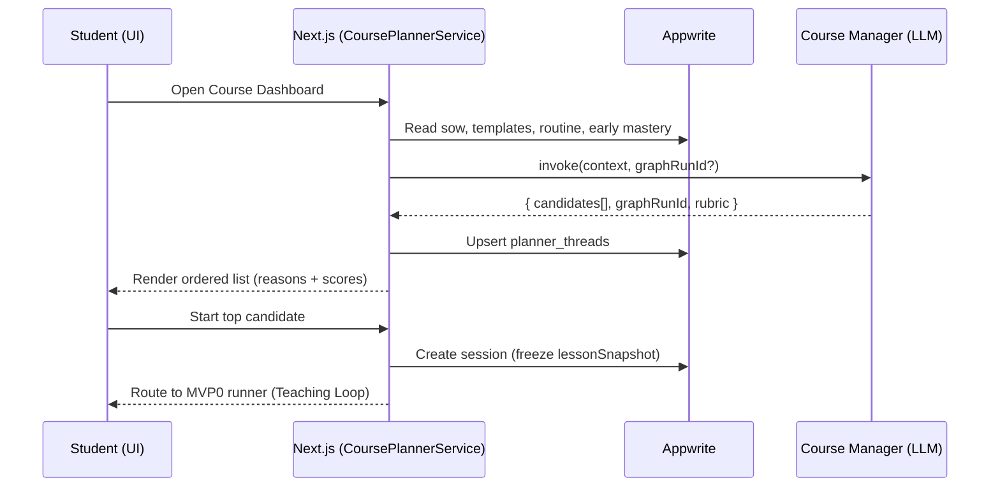

# MVP1 — Multi‑Course Enrolment & Course Manager Recommender — Design Brief

**Product:** Multi‑Course Agentic Tutor (SQA)\
**Scope:** MVP1 (builds on MVP0 Teaching Loop)\
**Date:** 15 Sep 2025 (Europe/London)\
**Status:** Draft for review\
**Author:** Team Sociotech

---

## Problem Statement

Students can complete an individual lesson via the MVP0 teaching loop, but they cannot yet reliably **enrol in multiple SQA courses** and receive a **ranked set of next lessons** that reflects their Scheme of Work (SoW), due/overdue outcomes, and early mastery signals. Today, the student has to manually pick a lesson; there is no consistent **course‑level planning** or transparent **reasoning** behind what to learn next.

**Who is affected:** students studying multiple National qualifications (e.g., **National 3 Applications of Mathematics**, Physics, English).

**Consequences of not solving:** fragmented learning, duplicated effort choosing lessons, lower motivation, and slower progress toward SQA qualifications.

**Constraints:**

- **Security & simplicity:** Only **Next.js** accesses **Appwrite** (Auth/DB). **LangGraph** is pure inference; it does **not** call the DB directly.
- **Grounding:** The content model must remain compatible with SQA outcomes and the AoM N3 templates from MVP0.
- **Checkpoints:** LangGraph graphs may checkpoint; **Next.js** persists `graphRunId` for continuity.

---

## Solution Overview

Implement a **Course Manager recommender** that ranks lesson templates per **enrolment** `(studentId, courseId)` and returns a **prioritised list of lesson candidates** with transparent reasons and scores. The student views this ordered list on the **Enrollment Dashboard** and can launch a lesson with one click. The existing **MVP0 Teaching Loop** runs the lesson to completion (design → deliver → mark → progress), after which Next.js updates mastery and spacing.

**Key ideas:**

- Add a **Next.js business‑logic component** `CoursePlannerService` that composes all needed metadata (SoW, templates, routine signals, early mastery) for the Course Manager.
- The **Course Manager** subgraph is a **pure LLM recommender**. It accepts a `SchedulingContextForCourse` and returns `CourseRecommendation { candidates[], rubric, graphRunId }`.
- Persist the Course Manager’s **checkpoint thread id** (`graphRunId`) in `planner_threads` so recommendations can be **resumed** and improved over time.
- On student selection, **Next.js** freezes a **lessonSnapshot**, creates a **session**, and runs the **MVP0 teaching loop**. On completion, it updates **mastery (EMA)** and **routine due dates**.

**Expected outcome:** students can enrol in **multiple courses**, see a **ranked list** of what to do next in each course (with reasons like *overdue*, *low EMA*, *short win*), and start a lesson that runs end‑to‑end.

---

## Key Design Decisions

### 1. Architecture Pattern — “Next.js Gateway; LLM as Recommender”

**Problem:** We need AI‑assisted planning without giving the LLM direct DB access.

**Solution:** Keep **Next.js** as the **only** Appwrite client. It prepares a **SchedulingContextForCourse** from DB and invokes the **Course Manager** subgraph (LLM). The subgraph only **recommends**; it never writes to DB.

**Alternatives considered:**

- LangGraph reading/writing DB directly — rejected (security, complexity, auditability).
- Fully deterministic rule‑based planner — rejected for now (less adaptive/transparent reasoning).

**Benefits:**

- Strong security boundary & simple audit trail.
- Clear separation of responsibilities (DB orchestration vs AI reasoning).
- Easy to evolve the ranking rubric without schema churn.

**Trade‑offs:**

- Slightly more glue code in Next.js to gather context and persist checkpoints.

### 2. Data Model — Minimal Additions with Checkpointing

**Problem:** Need persistence for the recommender’s **thread** and deterministic session snapshots.

**Solution:** Reuse pre‑existing MVP0 collections; add ``.

**Additions:**

- `planner_threads`: `{ studentId, courseId, graphRunId, updatedAt }` (unique per `(studentId, courseId)`).

**Unchanged (from MVP0):** `students`, `courses`, `course_outcomes`, `enrollments`, `sow`, `lesson_templates`, `sessions`, `evidence`, `mastery`, optional `routine`.

**Example:**

```ts
interface PlannerThread { studentId: ID; courseId: ID; graphRunId: string; updatedAt: ISO; }
```

---

#### Appwrite Collections after MVP1 (Nat 3 Applications of Mathematics — Concrete Examples)

Below are **representative documents** showing what Appwrite will contain **after MVP1** for a student enrolled in **National 3 — Applications of Mathematics**.

> IDs are illustrative. All timestamps are ISO (UTC). Only key fields shown.

**1) students** (from Auth profile; already present)

```json
{
  "$id": "stu_123",
  "displayName": "Amina",
  "accommodations": ["chunking", "extra_time"],
  "createdAt": "2025-09-01T08:00:00Z"
}
```

**2) courses** (seeded)

```json
{
  "$id": "course_c84473",
  "subject": "Applications of Mathematics",
  "level": "Nat3",
  "sqaCode": "C844 73"
}
```

**3) enrollments** (student ↔ course)

```json
{
  "$id": "enr_001",
  "studentId": "stu_123",
  "courseId": "course_c84473",
  "enrolledAt": "2025-09-02T09:00:00Z"
}
```

**4) sow** (Scheme of Work for this enrollment)

```json
{
  "$id": "sow_001",
  "studentId": "stu_123",
  "courseId": "course_c84473",
  "entries": [
    { "order": 1, "lessonTemplateId": "lt_nat3_num_frac_dec_pct_v1" },
    { "order": 2, "lessonTemplateId": "lt_nat3_aom_best_deal_v1" },
    { "order": 3, "lessonTemplateId": "lt_nat3_ssm_perim_area_vol_v1" }
  ],
  "createdAt": "2025-09-02T09:05:00Z"
}
```

**5) lesson\_templates** (published templates; seeded)

```json
{
  "$id": "lt_nat3_num_frac_dec_pct_v1",
  "title": "Fractions ↔ Decimals ↔ Percents (Money contexts)",
  "outcomeRefs": ["H22573_O1.2", "H22573_O1.5"],
  "estMinutes": 20,
  "version": 1,
  "status": "published",
  "cards": [ { "id": "q1", "type": "mcq", "cfu": { "type": "mcq", "options": ["10%","12.5%","20%"], "answerIndex": 1 } } ]
}
```

```json
{
  "$id": "lt_nat3_aom_best_deal_v1",
  "title": "Best Deal: Unit Price & Simple Discounts",
  "outcomeRefs": ["HV7Y73_O1.4", "H22573_O1.2", "H22573_O1.5"],
  "estMinutes": 25,
  "version": 1,
  "status": "published",
  "cards": [ { "id": "q1", "type": "short", "cfu": { "type": "short", "expected": "2.80" } } ]
}
```

```json
{
  "$id": "lt_nat3_ssm_perim_area_vol_v1",
  "title": "Perimeter, Area & Volume (Rectangles & Cuboids)",
  "outcomeRefs": ["H22573_O2.1"],
  "estMinutes": 20,
  "version": 1,
  "status": "published",
  "cards": [ { "id": "q1", "type": "short", "cfu": { "type": "short", "expected": "24" } } ]
}
```

**6) planner\_threads** (new in MVP1: recommender checkpoint)

```json
{
  "$id": "pth_001",
  "studentId": "stu_123",
  "courseId": "course_c84473",
  "graphRunId": "thread_cm_stu_123_course_c84473",
  "updatedAt": "2025-09-03T09:10:00Z"
}
```

**7) sessions** (created when the student clicks Start)

```json
{
  "$id": "sess_001",
  "studentId": "stu_123",
  "courseId": "course_c84473",
  "lessonTemplateId": "lt_nat3_aom_best_deal_v1",
  "lessonSnapshot": {
    "title": "Best Deal: Unit Price & Simple Discounts",
    "outcomeRefs": ["HV7Y73_O1.4", "H22573_O1.2", "H22573_O1.5"],
    "cards": [ { "id": "q1", "type": "short", "cfu": { "type": "short", "expected": "2.80" } } ],
    "templateVersion": 1
  },
  "startedAt": "2025-09-03T09:12:00Z",
  "stage": "design"
}
```

**8) evidence** (created at lesson END; one per attempt)

```json
{
  "$id": "ev_001",
  "sessionId": "sess_001",
  "itemId": "q1",
  "attemptIndex": 0,
  "response": "2.80",
  "correct": true,
  "score": 1,
  "outcomeScores": { "HV7Y73_O1.4": 1, "H22573_O1.2": 1, "H22573_O1.5": 1 },
  "submittedAt": "2025-09-03T09:16:00Z",
  "feedback": "Great — £2.80 per kg is cheaper per 100 g."
}
```

**9) mastery** (EMA per outcome; updated at END)

```json
{
  "$id": "mas_001",
  "studentId": "stu_123",
  "courseId": "course_c84473",
  "emaByOutcome": {
    "HV7Y73_O1.4": 0.83,
    "H22573_O1.2": 0.72,
    "H22573_O1.5": 0.46
  },
  "updatedAt": "2025-09-03T09:16:10Z"
}
```

**10) routine** (scheduling cache with `dueAtByOutcome`)

```json
{
  "$id": "rt_001",
  "studentId": "stu_123",
  "courseId": "course_c84473",
  "lastTaughtAt": "2025-09-03T09:16:10Z",
  "dueAtByOutcome": {
    "H22573_O1.2": "2025-09-06T00:00:00Z",  
    "HV7Y73_O1.4": "2025-09-08T00:00:00Z",  
    "H22573_O1.5": "2025-09-04T00:00:00Z"   
  },
  "spacingPolicyVersion": 1,
  "schema_version": 1
}
```

---

#### How the Database Changes During MVP1 Flows

**A) Fetch recommendations** (dashboard):

- **Read**: `sow`, `lesson_templates (published)`, `routine`, `mastery`, `planner_threads`.
- **Write**: `planner_threads` (upsert `graphRunId` returned by Course Manager).

**B) Start a lesson**:

- **Read**: `lesson_templates` (for chosen template).
- **Write**: `sessions` (with **frozen** `lessonSnapshot`).

**C) Finish a lesson** (MVP0 loop END):

- **Write**: `evidence` (attempt rows), `mastery` (EMA updates), `routine.dueAtByOutcome` and `lastTaughtAt`.

These examples show exactly what Appwrite will contain **after MVP1**, and how each operation affects specific collections.

---

### 3. Integration Strategy — Contracts Instead of Tight Coupling — Contracts Instead of Tight Coupling

**Problem:** We must hand AI only the data it needs and accept structured results.

**Solution:** Define **strict input/output contracts** for the Course Manager.

**Input** — `SchedulingContextForCourse`

```ts
export interface SchedulingContextForCourse {
  student: { id: string; displayName?: string; accommodations?: string[] };
  course: { id: string; subject: string; level: string };
  sow: { entries: Array<{ order: number; lessonTemplateId: string; plannedAt?: string }> };
  templates: Array<{ $id: string; title: string; outcomeRefs: string[]; tags?: string[]; estMinutes?: number; version: number; status: "published" }>; // filtered to published
  mastery?: { emaByOutcome: { [outcomeId: string]: number } };
  routine?: { dueAtByOutcome: { [outcomeId: string]: string }; lastTaughtAt?: string; recentTemplateIds?: string[] };
  constraints?: { maxBlockMinutes?: 25|45; avoidRepeatWithinDays?: number; varietyAcrossUnits?: boolean; preferOverdue?: boolean; preferLowEMA?: boolean };
  graphRunId?: string; // (resume recommender)
}
```

**Output** — `CourseRecommendation`

```ts
export interface LessonCandidate {
  lessonTemplateId: string; title: string; targetOutcomeIds: string[];
  estimatedMinutes?: number; priorityScore: number; reasons: string[]; flags?: string[];
}
export interface CourseRecommendation {
  courseId: string; generatedAt: string; graphRunId: string;
  candidates: LessonCandidate[]; rubric: string;
}
```

**Recommender rubric (MVP1 default):**

- +0.40: covers ≥1 **overdue** outcomes (from `routine.dueAtByOutcome` ≤ now)
- +0.25: covers ≥1 **low‑EMA** outcomes (`ema < 0.6`)
- +0.15: **early SoW order** (smaller `order`)
- −0.10: **recently taught** (`lessonTemplateId` in last N sessions)
- −0.05: **estimatedMinutes** exceeds `maxBlockMinutes`
- Tie‑break: **variety across units** (if enabled), else lexicographic by title for determinism.

---

## Technical Architecture

### System Components

```
app/
├─ (dashboard)/                 # Enrollment dashboard (SSR/CSR hybrid)
├─ (enrol)/                     # Course enrolment flow
├─ session/[id]/                # MVP0 runner (teaching loop UI)
└─ api/
   ├─ enrol/                    # POST — create enrollments + bootstrap SoW
   ├─ recommendations/[course]  # GET  — returns CourseRecommendation (candidates)
   └─ sessions/start            # POST — creates session from chosen template

lib/
├─ appwrite/                    # typed SDK wrappers, queries, guards
├─ planners/
│  ├─ CoursePlannerService.ts   # builds SchedulingContextForCourse; persists planner_threads
│  └─ contracts.ts              # TS types for context and recommendation
└─ graphs/
   ├─ course_manager/           # LangGraph subgraph (recommender only)
   └─ teaching_loop/            # MVP0 graph (design → mark → progress → done)
```

### Data Flow (MVP1)



**ASCII (alternate view)**

```
Student  →  Dashboard  →  Next.js (CoursePlannerService)  →  Appwrite  →  Course Manager
  |            |               |  (load sow/templates)        |           (rank & return)
  |            |               +----------------------------->|
  |            |               |  ctx + graphRunId?          |
  |            |<--------------+  candidates + graphRunId    |
  |  pick →    |               |  persist planner_threads    |
  |            |---- start ----> create session (snapshot)   |
  |            |==== MVP0 teaching loop runner ==============>
```

### Technology Stack

- **Runtime:** Node.js 20+
- **Frontend:** Next.js (App Router), TypeScript, Assistant‑UI (LangGraph adaptor)
- **Backend:** Next.js API routes + server actions
- **DB/Auth:** Appwrite (Auth, Database)
- **LLM orchestration:** LangGraph (checkpointing enabled)
- **Validation & types:** Zod + TypeScript `contracts.ts`

---

## Implementation Approach

### 0) Definition of Done (MVP1)

A student can open the **Enrollment Dashboard**, fetch a **ranked list of lesson candidates** for an enrolled course, view **reasons & scores**, click **Start** (or **Top Pick**), and be routed into the existing **MVP0 teaching loop**. The run completes and evidence/mastery are persisted. The Course Manager recommender returns a `` which is stored in `planner_threads` and reused on the next recommendation request.

---

### 1) Development Phases (expanded)

#### Phase 1 — Core

-

#### Phase 2 — Hardening

-

#### Phase 3 — Operability & Scale

-

---

### 2) Detailed Build Plan

#### 2.1 Next.js — CoursePlannerService (server‑side)

**Responsibilities**

- Fetch and **normalise** inputs from Appwrite (SoW, published templates, routine, mastery).
- Populate **constraints** (defaults: `maxBlockMinutes=25`, `avoidRepeatWithinDays=2`, `varietyAcrossUnits=true`, `preferOverdue=true`, `preferLowEMA=true`).
- Attach prior `` (from `planner_threads`) to allow recommender resume.
- Call LangGraph adapter: `invokeCourseManager(context, graphRunId?)`.
- Persist returned ``; return `CourseRecommendation` to UI.

**Context normalisation rules**

- **Templates**: include only `status === "published"`; ensure `outcomeRefs` are de‑duplicated.
- **Routine**: coerce all `dueAtByOutcome` to **UTC ISO**; compute `isOverdue` = `dueAt <= now` for quick badges.
- **Mastery**: clamp EMA to `[0,1]`; if missing, seed with `0.5` for unseen outcomes (server‑side only; do not pass synthetic values as real mastery rows).
- **Coverage** (optional): compute `% covered` and `remainingOutcomes[]` (used for tie‑break variety).

**Adapter signature**

```ts
async function invokeCourseManager(
  ctx: SchedulingContextForCourse,
  graphRunId?: string
): Promise<CourseRecommendation>
```

#### 2.2 LangGraph — Course Manager subgraph

**ASCII — Graphs Overview**

**A) High‑level (MVP1 + MVP0)**

```
Student UI
   |
   v
+----------------------+
| Enrollment Dashboard |
+----------+-----------+
           |
           v
+-------------------------------+
| Next.js CoursePlannerService  |
+-------+-----------------------+
        |  build context (SoW, templates, routine, mastery, constraints, graphRunId?)
        v
+---------------------------+
| Course Manager (LLM)      |
| score → rank → emit       |
+-------------+-------------+
              |
              v
   +----------+-----------+
   | Ranked Candidates    |  (Top‑K, reasons, scores, graphRunId)
   +----------+-----------+
              |
       Start candidate
              |
              v
   +----------------------+
   | Freeze lessonSnapshot|
   +----------+-----------+
              v
   +----------------------+
   |  MVP0 Teaching Loop  |
   +--+----+------+---+---+
      |    |      |   |
   design  |   progress |
      |    |            |
      v    v            v
  get_answer → mark → (progress | retry) → design … → END (summary)
```

**B) Course Manager subgraph (recommender)**

```
[entry]
  |
  v
+-----------------------+
| score_templates       |  (+overdue, +lowEMA, +earlyOrder, −recent, −tooLong)
+-----------+-----------+
            |
            v
+-----------------------+
| rank_and_explain      |  (stable sort, tie‑break variety, build rubric)
+-----------+-----------+
            |
            v
+-----------------------+
| emit_recommendations  |  (top‑K, generatedAt, graphRunId)
+-----------------------+
            |
            v
           END
```

**C) MVP0 Teaching Loop (tool‑call + interrupt)**

```
START
  |
  v
+--------+      +------------+
| design | ---> | get_answer |
+---+----+      +-----+------+
    |                 |
    | (stage=mark)    | (always returns to design with interrupt payload)
    v                 v
+---+----+      +------------+
| mark   | ----> |  design   |
+---+----+      +------------+
    |  \
    |   \ (incorrect & attempts < max)
    |    v
    |  +--------+        +------------------+
    |  | retry  |  --->  | get_answer_retry |
    |  +---+----+        +---------+--------+
    |      |                        |
    |      +-----------<------------+
    |
 (correct OR max attempts reached)
    v
+--------+
|progress|
+---+----+
    |
    v
 design (next card) … if last card → generate summary tool‑call → END
```

**Nodes**

1. `score_templates` — compute raw score + reasons per template
   - Heuristics (mirror rubric):
     - `+0.40` if intersects **overdue** outcomes
     - `+0.25` if intersects **low‑EMA** outcomes (`EMA < 0.6`)
     - `+0.15` for **early SoW order** (map `order → 0..0.15`)
     - `−0.10` if `lessonTemplateId ∈ recentTemplateIds`
     - `−0.05` if `estMinutes > maxBlockMinutes`
   - Emit `reasons: string[]` per rule hit; include flags (e.g., `"long lesson"`).
2. `rank_and_explain` — stable sort by score (desc), tie‑breakers:
   - Prefer **varietyAcrossUnits** (if enabled) using outcome prefix or tag; then lexicographic by title.
   - Compute `priorityScore` in `[0,1]` and `rubric` one‑liner (e.g., `"Overdue>LowEMA>Order | -Recent -TooLong"`).
3. `emit_recommendations` — limit **top K** (default 5), add timestamps, and return `{ candidates, rubric, graphRunId }`.

**Checkpointing**

- Compile with `checkpointer=True`; Next.js passes `thread_id=graphRunId` via adapter config.
- On success, return the **effective** `graphRunId` so the server can upsert `planner_threads`.

**Determinism**

- Use **fixed weights** and **sorted inputs** for reproducibility.
- Avoid free‑form generation; return structured JSON only.

#### 2.3 API Routes

**GET **``

- Auth guard → resolve `studentId`.
- Call `CoursePlannerService.recommendLessons(studentId, courseId)`.
- Response: `CourseRecommendation` (HTTP 200) or fallback recommendation.

**POST **``

- Body: `{ courseId, lessonTemplateId }` (Zod‑validated).
- Steps: read template → **freeze** `lessonSnapshot` → write `sessions` (stage `"design"`) → return `{ sessionId }`.

#### 2.4 Frontend — Enrollment Dashboard

- **SSR** shell + CSR fetch for recommendations.
- Render each candidate row with:
  - Title + unit/outcome chips
  - **Reason badges** (overdue / low EMA / short win / early order / recent)
  - Score pill (0–1, rounded to 2 d.p.)
  - **Start** button → calls `/api/sessions/start`
- **Top Pick** primary CTA = first candidate.
- Empty/error/loading states.

---

### 3) Error Handling & Fallbacks

- **LLM error/timeout** → log with `graphRunId`; serve **fallback** list (SoW order, shortest first), `rubric: "Fallback: SoW + shortest"`.
- **No templates published** → 204/empty with UI message “Content coming soon”.
- **Template missing/unpublished at start** → show alternative (next candidate) or prompt refresh.
- **Stale planner thread** → ignore stored `graphRunId` and create a new thread; upsert.

---

### 4) Caching & Performance

- **Recommendation cache**: per `(studentId, courseId)` for **5–15 min** (configurable). Keyed by hash of context (`sow.entries`, `templates.$id+version`, top‑level routine timestamps, and mastery hashes). Invalidate on **lesson completion** or **assessment**.
- **Prefetch** templates on dashboard load for all enrolled courses.
- Target **p95 < 500 ms** (warm); cold can be higher on first invocation.

---

### 5) Security & PII

- Only pass **non‑sensitive** student fields to LLM (e.g., `displayName` if needed, `accommodations`).
- Enforce **owner‑only** read of `sow`, `sessions`, `evidence`, `mastery`.
- No Appwrite API keys or IDs exposed to the graph; LLM is **stateless** re: secrets.

---

### 6) Observability & Telemetry

- Log fields: `studentId`, `courseId`, `graphRunId`, `candidateCount`, `topReasons`, `latencyMs`, `cacheHit`.
- Emit counters: `recommendation.success`, `recommendation.fallback`, `session.start.success`.
- Basic tracing: correlate dashboard action → recommendation → session start via `graphRunId`.

---

### 7) Testing Strategy (expanded)

- **Unit (server)**: context assembly, rubric scoring, fallback ordering.
- **Contract (API)**: schema‑valid responses; auth/ownership checks; error codes.
- **Integration**: seeded Appwrite → GET recommendations → POST start → enters MVP0 runner.
- **E2E (happy path)**: Cypress/Playwright script clicks **Top Pick**, completes one short lesson.
- **Fixtures**: AoM Nat3 seed with 3 templates and routine/mastery stubs (overdue/low EMA cases).

---

### 8) Release & Rollback

- **Feature flag** `recommender.enabled` (on/off), gradated by cohort.
- **Rollback**: toggle flag off; dashboard falls back to **SoW order list** with Start buttons.
- **Post‑release checks**: monitor p95 latency, fallback rate, CTR on **Top Pick**.

---

### API/Interface Design

```http
# Enrol & bootstrap (already exists from MVP1 foundation)
POST /api/enrol
Body: { courseIds: string[] }

# Fetch ranked candidates for a course (recommender)
GET /api/recommendations/:courseId
Response: CourseRecommendation

# Start a session from a selected template
POST /api/sessions/start
Body: { courseId: string; lessonTemplateId: string }
Response: { sessionId: string }
```

---

## Stakeholder Benefits

### For Students

- Clear, **ranked next steps** with transparent reasons (overdue/low EMA/short win).
- One‑click start; consistent lesson experience from MVP0.

### For Developers

- Clean **contracts** between Next.js and LangGraph; easy to test.
- Checkpointed recommendations (`graphRunId`) for reproducibility and iteration.

### For Operations/DevOps

- Single DB gateway (Next.js) simplifies secrets and observability.
- Minimal moving parts; scale UI and API independently.

### For Business

- Delivers multi‑course value quickly; improves engagement and retention.
- Sets up future **Study Mode** (MVP2) without rework.

---

## Risk Analysis & Mitigation

| Risk                          | Impact | Prob.  | Mitigation                                                                        |
| ----------------------------- | ------ | ------ | --------------------------------------------------------------------------------- |
| LLM unavailable/timeout       | Medium | Medium | Deterministic fallback: SoW order + shortest template; cache last good candidates |
| Recommendation feels opaque   | Medium | Medium | Always show **reasons** and a short **rubric** string                             |
| Over‑ or under‑fitting rubric | Low    | Medium | Feature‑flag weights; add analytics; A/B later                                    |
| Checkpoint misuse             | Low    | Low    | Store `graphRunId` per `(studentId, courseId)`; rotate on schema change           |

### Data Integrity & Security

- **Validation:** Zod on inbound/outbound contracts; type guards per API route.
- **Security:** Appwrite Auth (owner‑only access for sow/sessions/evidence/mastery). No DB secrets in the graph.
- **Compliance:** GDPR‑aware: pass **minimal PII** into the LLM (displayName only if needed). Keep IDs server‑side.
- **Recovery:** Sessions and evidence are canonical; recommendations can be re‑computed.

### Performance Considerations

- **Targets:** Recommendations API **< 500 ms** p95 (with warm cache); Session start **< 300 ms**.
- **Optimisation:** Preload templates for enrolled courses; cache SoW; use Appwrite indexes.
- **Monitoring:** API latencies, LLM usage, error rate; basic tracing on `graphRunId`.

---

## Dependencies & Prerequisites

### Technical Dependencies

- Appwrite project with collections from MVP0 + `planner_threads` added.
- Seed **lesson\_templates** for at least National 3 **Applications of Mathematics**:
  - `lt_nat3_num_frac_dec_pct_v1`
  - `lt_nat3_aom_best_deal_v1`
  - `lt_nat3_ssm_perim_area_vol_v1`
- Auth already working (✅ from MVP0).

### Process Dependencies

- Agreement on initial scoring **rubric weights**.
- Design sign‑off for dashboard list UX (reasons badges & Top Pick CTA).

---

## Success Criteria

1. **Functional:** Student sees **≥3** ranked candidates per enrolled course and can start any candidate end‑to‑end.
2. **Performance:** p95 **< 500 ms** for `/api/recommendations/:courseId` (with warm template cache).
3. **Reliability:** Recommender returns a valid list **≥ 99%** of requests (fallbacks kick in otherwise).
4. **Maintainability:** All contracts typed; unit tests for `CoursePlannerService`.
5. **Business:** Median time from dashboard → lesson start **< 2 min**; first‑week repeat usage **+20%** vs MVP0.

---

## Open Questions & Decisions Needed

1.

---

## Appendices

### A. Glossary

- **SoW** — Scheme of Work, the ordered lesson plan for an enrolment.
- **EMA** — Exponential Moving Average (mastery measure 0–1).
- **Outcome** — Atomic assessable standard (e.g., `H225 73 O1.2`).
- **Lesson Snapshot** — Frozen copy of a template’s cards for a session.
- **graphRunId** — LangGraph checkpoint thread/run identifier.

### B. References

- MVP0 Design Pack in Canvas (N3 AoM)
- SQA National 3 Applications of Mathematics (C844 73) course & unit specs (used for template design)

### C. Alternative Approaches Considered

**Alt 1: Deterministic Planner Only**\
Pros: predictable, fast; Cons: less adaptive; no transparent reasoning; harder to personalise.\
**Reason rejected:** we want AI explanations and flexible heuristics.

---

## Summary of Next Steps

### Toward MVP2 — Daily Study Mode (Lead Teacher Orchestrator)

- **Compose** from **per‑course** recommendations (reuse each course’s `planner_threads`).
- Produce a **cross‑course StudyPlan** sized to a timebox (e.g., 45 minutes) with items like `{ courseId, lessonTemplateId, minutes, reasons[] }`.
- Persist **Lead Teacher** checkpoint in `lead_teacher_threads` and show **Plan Preview** UI with a **Start Plan** CTA.

### Toward MVP3 — Progress & Evidence (Student‑facing)

- Build **Progress Dashboard** per course: outcome‑level EMA, due/overdue, recent evidence.
- **Evidence Viewer**: attempts, feedback, explanations per lesson card.
- Add **Resume/Next** per course and minimal **due badges**.

---

**Document Status:** Draft\
**Last Updated:** 15 Sep 2025\
**Author(s):** Team Sociotech\
**Reviewers:** (TBD)

